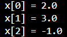
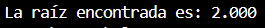
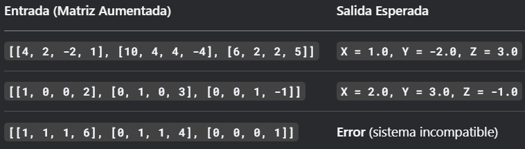
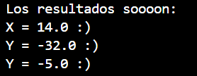

# 📘 Diferenciación e Integración Numérica

Este repositorio contiene una colección de ejercicios desarrollados como parte del curso de **Métodos Numéricos**, específicamente enfocados en la **diferenciación e integración de funciones** mediante técnicas numéricas. Se implementan algoritmos en Java para resolver problemas de derivación e integración aproximada de funciones.

---

## 📑 Índice

- [📄 Descripción del Problemario](#descripcion-del-problemario)
- [📚 Sobre la Materia](#sobre-la-materia)
  - [🎯 Competencia de la Asignatura](#competencia-de-la-asignatura)
  - [🔍 Competencia del Tema](#competencia-del-tema)
  - [📌 Temario](#temario)
- [📊 Métodos de Diferenciación e Integración](#metodos-de-diferenciacion-e-integracion)
  - [🔹 Fórmula de Tres Puntos](#formula-de-tres-puntos)
  - [🔸 Fórmula de Cinco Puntos](#formula-de-cinco-puntos)
  - [📐 Método del Trapecio](#metodo-del-trapecio)
  - [📏 Regla de Simpson](#regla-de-simpson)
  - [📌 Cuadratura Gaussiana](#cuadratura-gaussiana)

---

## 📄 Descripción del Problemario <a name="descripcion-del-problemario"></a>

En este tema se desarrollan implementaciones para aproximar derivadas e integrales de funciones matemáticas utilizando métodos numéricos como:

- 🔹 **Fórmula de Tres Puntos**
- 🔸 **Fórmula de Cinco Puntos**
- 📏 **Regla de Simpson**
- 📌 **Cuadratura Gaussiana**

Cada técnica incluye su descripción, pasos generales, y su respectiva implementación en Java.

---

## 📚 Sobre la Materia <a name="sobre-la-materia"></a>

### 🎯 Competencia de la Asignatura <a name="competencia-de-la-asignatura"></a>

Aplicar métodos numéricos para resolver problemas científicos y de ingeniería utilizando la computadora.

### 🔍 Competencia del Tema <a name="competencia-del-tema"></a>

Aplicar técnicas numéricas para obtener derivadas e integrales aproximadas de funciones, desarrollando soluciones computacionales eficientes.

### 📌 Temario <a name="temario"></a>

- Fórmula de Tres Puntos
- Fórmula de Cinco Puntos
- Método del Trapecio
- Regla de Simpson
- Cuadratura Gaussiana

---

## 📊 Métodos de Diferenciación e Integración <a name="metodos-de-diferenciacion-e-integracion"></a>

### 🔹 Fórmula de Tres Puntos <a name="formula-de-tres-puntos"></a>

**Descripción:**  
Esta fórmula se utiliza para calcular la derivada de una función en un punto utilizando tres valores tabulados.

**Pasos Generales:**
1. Evaluar la función en tres puntos: `f(x - h)`, `f(x)` y `f(x + h)`.
2. Aplicar la fórmula central:  
   `f'(x) ≈ (f(x + h) - f(x - h)) / (2h)`

**Código en Java:**
```java
/**
 * Clase que implementa el método de derivación numérica por tres puntos.
 */
public class DerivacionTresPuntos {

    public static void main(String[] args) {
        // Ejemplo de uso
        double punto = 2.0;  // Punto donde se calcula la derivada
        double h = 0.0001;   // Tamaño del paso (h) recomendado: 1e-4 a 1e-6

        try {
            double derivada = derivadaTresPuntos(punto, h);
            double valorExacto = dfExacta(punto);  // Valor exacto para comparación

            System.out.println("Derivada numérica (3 puntos): " + String.format("%.8f", derivada));
            System.out.println("Derivada exacta: " + String.format("%.8f", valorExacto));
            System.out.println("Error absoluto: " + String.format("%.8f", Math.abs(derivada - valorExacto)));
        } catch (IllegalArgumentException e) {
            System.out.println("Error: " + e.getMessage());
        }
    }

    public static double derivadaTresPuntos(double x, double h) {
        // Validación del parámetro h
        if (h <= 0) {
            throw new IllegalArgumentException("El tamaño del paso h debe ser positivo.");
        }

        // Fórmula de tres puntos centrada: [f(x+h) - f(x-h)] / (2h)
        return (f(x + h) - f(x - h)) / (2 * h);
    }

    public static double f(double x) {
        return x * x * x - 2 * x + 1;  // Ejemplo: f(x) = x³ - 2x + 1
    }

    public static double dfExacta(double x) {
        return 3 * x * x - 2;
    }
}
```


### 🔸 Fórmula de Cinco Puntos <a name="formula-de-cinco-puntos"></a>

**Descripción:**  
Proporciona una mayor precisión que la fórmula de tres puntos, utilizando cinco valores de la función.

**Pasos Generales:**
1. Evaluar f(x - 2h), f(x - h), f(x + h), f(x + 2h).
2. Aplicar la fórmula:
           f'(x) ≈ (-f(x + 2h) + 8f(x + h) - 8f(x - h) + f(x - 2h)) / (12h)

**Código en Java:**
```java
public class DerivacionCincoPuntos {

    public static void main(String[] args) {
        // Configuración de parámetros
        double x = 2.0;      // Punto donde se calcula la derivada
        double h = 0.01;     // Tamaño del paso (óptimo para este método)
        
        try {
            // Cálculo de derivadas
            double derivadaAprox = redondear(derivadaCincoPuntos(x, h), 3);
            double derivadaExacta = redondear(dfExacta(x), 3);
            
            // Mostrar resultados
            System.out.println("Método de 5 puntos - f'(x) en x=" + x + ":");
            System.out.println("Aproximación: " + derivadaAprox);
            System.out.println("Valor exacto: " + derivadaExacta);
            System.out.println("Error absoluto: " + redondear(Math.abs(derivadaAprox - derivadaExacta), 3));
            
        } catch (IllegalArgumentException e) {
            System.out.println("Error en cálculo: " + e.getMessage());
        }
    }

    public static double derivadaCincoPuntos(double x, double h) {
        if (h <= 0) throw new IllegalArgumentException("h debe ser positivo");
        
        return (-f(x + 2*h) + 8*f(x + h) - 8*f(x - h) + f(x - 2*h)) / (12 * h);
    }

    /**
     * Función de ejemplo: f(x) = e^x * sin(x)
     */
    public static double f(double x) {
        return Math.exp(x) * Math.sin(x);
    }

    /**
     * Derivada exacta de f(x) = e^x * sin(x) → f'(x) = e^x(sin(x) + cos(x))
     */
    public static double dfExacta(double x) {
        return Math.exp(x) * (Math.sin(x) + Math.cos(x));
    }

    public static double redondear(double valor, int decimales) {
        double factor = Math.pow(10, decimales);
        return Math.round(valor * factor) / factor;
    }
}
```


### 📏 Regla de Simpson <a name="regla-de-simpson"></a>

**Descripción:**  
Utiliza parábolas para aproximar el área bajo la curva, proporcionando mayor precisión que el método del trapecio.

**Pasos Generales:**
1. Dividir el intervalo en n subintervalos pares.
2. Aplicar:
∫f(x)dx ≈ (h/3) * [f(a) + 4Σf(xi impares) + 2Σf(xi pares) + f(b)]

**Código en Java:**
```java
public class IntegracionSimpson {

    /**
     * Método principal para demostración.
     */
    public static void main(String[] args) {
        // Ejemplo: integral de 0 a 1 de e^(-x²)
        double a = 0.0;
        double b = 1.0;
        int n = 10; // Número de subintervalos (debe ser par)

        try {
            double resultado = redondear(simpson(a, b, n), 5);
            System.out.println("Aproximación de la integral: " + resultado);
            
            // Valor de referencia para comparación
            double valorReal = 0.746824132812427;
            System.out.println("Valor de referencia: " + redondear(valorReal, 5));
            System.out.println("Error absoluto: " + redondear(Math.abs(resultado - valorReal), 5));
            
        } catch (IllegalArgumentException e) {
            System.out.println("Error: " + e.getMessage());
        }
    }


    public static double simpson(double a, double b, int n) {
        // Validar que n sea par
        if (n % 2 != 0) {
            throw new IllegalArgumentException("El número de subintervalos n debe ser par");
        }

        double h = (b - a) / n;  // Ancho de cada subintervalo
        double suma = f(a) + f(b); // Suma inicial (extremos)

        // Sumar los términos pares e impares
        for (int i = 1; i < n; i++) {
            double x = a + i * h;
            // Términos impares multiplicados por 4, pares por 2
            suma += (i % 2 == 0 ? 2 : 4) * f(x);
        }

        return (h / 3) * suma; // Fórmula final de Simpson
    }


    public static double f(double x) {
        return Math.exp(-x * x); // Función gaussiana
    }

    public static double redondear(double valor, int decimales) {
        double factor = Math.pow(10, decimales);
        return Math.round(valor * factor) / factor;
    }
}
```


### 📌 Cuadratura Gaussiana <a name="cuadratura-gaussiana"></a>

**Descripción:**  
Método avanzado que utiliza pesos y nodos específicos para evaluar integrales con alta precisión usando pocos puntos.

**Pasos Generales:**
1. Transformar el intervalo [a, b] a [-1, 1].
2. Usar nodos y pesos según el número de puntos (por ejemplo, 2 o 3).
3. Calcular la integral como suma ponderada:
   ∫f(x)dx ≈ Σ wᵢ * f(xᵢ)

**Código en Java:**
```java
public class CuadraturaGaussiana {

    public static void main(String[] args) {
        // Ejemplo: integral de 0 a 1 de e^x
        double a = 0.0;
        double b = 1.0;

        try {
            double resultado = redondear(cuadraturaGaussiana(a, b), 6);
            double valorReal = Math.exp(1) - 1;  // e^1 - e^0 = e - 1
            
            System.out.println("Resultado por cuadratura gaussiana (2 puntos): " + resultado);
            System.out.println("Valor exacto: " + redondear(valorReal, 6));
            System.out.println("Error absoluto: " + redondear(Math.abs(resultado - valorReal), 6));
            
        } catch (Exception e) {
            System.out.println("Error: " + e.getMessage());
        }
    }

    public static double cuadraturaGaussiana(double a, double b) {
        // Puntos y pesos para cuadratura de 2 puntos ([-1/√3, 1/√3], pesos [1,1])
        final double[] x = { -1.0/Math.sqrt(3.0), 1.0/Math.sqrt(3.0) };
        final double[] w = { 1.0, 1.0 };

        double integral = 0.0;
        
        // Aplicar cambio de variable y sumar contribuciones
        for (int i = 0; i < x.length; i++) {
            // Mapear de [-1,1] a [a,b]
            double xi = ((b - a) * x[i] + (a + b)) / 2.0;
            integral += w[i] * f(xi);
        }
        
        return ((b - a) / 2.0) * integral;
    }

    public static double f(double x) {
        return Math.exp(x);
    }

    public static double redondear(double valor, int decimales) {
        double factor = Math.pow(10, decimales);
        return Math.round(valor * factor) / factor;
    }
}
```
