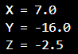
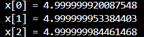
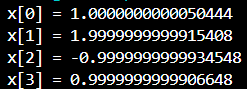

# Tema 3 – Métodos Numéricos: Sistemas de Ecuaciones Lineales

## Índice

- [Descripción del Problemario](#descripción-del-problemario)
- [Sobre la materia](#sobre-la-materia)
  - [Competencia de la asignatura](#competencia-de-la-asignatura)
  - [Competencia del tema](#competencia-del-tema)
- [Sistemas de ecuaciones](#sistemas-de-ecuaciones)
  - [1. Eliminación Gaussiana](#1-eliminación-gaussiana)
  - [2. Gauss-Jordan](#2-gauss-jordan)
  - [3. Gauss-Seidel](#3-gauss-seidel)
  - [4. Método de Jacobi](#4-método-de-jacobi)

---

## Descripción del Problemario

Este problemario contiene ejemplos prácticos resueltos con Java para encontrar soluciones a sistemas de ecuaciones lineales, utilizando distintos métodos numéricos. Cada ejercicio incluye una breve explicación del método utilizado, el código fuente y una imagen con el resultado de la ejecución.

---

## Sobre la materia

### Competencia de la asignatura

Aplicar los métodos numéricos para resolver problemas científicos y de ingeniería utilizando la computadora.

### Competencia del tema

Aplicar los métodos numéricos con el objeto de solucionar ecuaciones mediante métodos de intervalo e interpolación apoyados por un lenguaje de programación.

---

## Sistemas de ecuaciones

### 1. Eliminación Gaussiana

**Descripción del método:**  
El método de eliminación Gaussiana transforma un sistema de ecuaciones en una matriz escalonada superior mediante operaciones elementales. Posteriormente se realiza una sustitución hacia atrás para encontrar las soluciones.

**Pasos generales:**
1. Convertir la matriz aumentada del sistema en una forma triangular superior.
2. Aplicar sustitución hacia atrás para obtener las soluciones.

**Pseudocódigo**
```plaintext
Algoritmo EliminaciónGaussiana
    Inicio
        // Definir matriz aumentada del sistema
        n ← 3  // Número de incógnitas
        matriz ← [
            [2.0, 1.0, -1.0, 8.0],
            [-3.0, -1.0, 2.0, -11.0],
            [-2.0, 1.0, 2.0, -3.0]
        ]
        
        // Resolver el sistema
        solución ← EliminarGauss(matriz, n)
        
        // Mostrar resultados
        Para i desde 0 hasta n-1 hacer
            Escribir "x[", i, "] = ", solución[i]
        Fin para
    Fin

Función EliminarGauss(matriz, n) → arreglo de reales
    Inicio
        // Fase de eliminación hacia adelante
        Para i desde 0 hasta n-1 hacer
            Para j desde i+1 hasta n-1 hacer
                factor ← matriz[j][i] / matriz[i][i]
                Para k desde i hasta n hacer
                    matriz[j][k] ← matriz[j][k] - factor * matriz[i][k]
                Fin para
            Fin para
        Fin para
        
        // Fase de sustitución hacia atrás
        solución ← nuevo arreglo de tamaño n
        Para i desde n-1 hasta 0 hacer
            solución[i] ← matriz[i][n]  // Última columna (términos independientes)
            Para j desde i+1 hasta n-1 hacer
                solución[i] ← solución[i] - matriz[i][j] * solución[j]
            Fin para
            solución[i] ← solución[i] / matriz[i][i]
        Fin para
        
        Retornar solución
    Fin función
```

**Código Java:**
```java
package Eliminacion_Gaussiana;

public class Ejercicio1 {
    public static void main(String[] args) {
        int n = 3;
        double[][] matrix = {
            {2.0, 1.0, -1.0, 8.0},
            {-3.0, -1.0, 2.0, -11.0},
            {-2.0, 1.0, 2.0, -3.0}
        };

        double[] result = Eliminacion(matrix, n);
        for (int i = 0; i < n; i++) {
            System.out.println("x[" + i + "] = " + result[i]);
        }
    }

    public static double[] Eliminacion(double[][] matrix, int n) {
        for (int i = 0; i < n; i++) {
            for (int j = i + 1; j < n; j++) {
                double factor = matrix[j][i] / matrix[i][i];
                for (int k = i; k < n + 1; k++) {
                    matrix[j][k] -= factor * matrix[i][k];
                }
            }
        }

        double[] result = new double[n];
        for (int i = n - 1; i >= 0; i--) {
            result[i] = matrix[i][n];
            for (int j = i + 1; j < n; j++) {
                result[i] -= matrix[i][j] * result[j];
            }
            result[i] /= matrix[i][i];
        }

        return result;
    }
}
```


**Casos de prueba**


### 2. Gauss-Jordan

**Descripción del método:**  
Gauss-Jordan es una extensión de la eliminación Gaussiana que convierte la matriz aumentada en una matriz identidad, obteniendo directamente la solución del sistema.

**Pasos generales:**
1. Convertir la matriz aumentada en una matriz identidad.
2. La solución se obtiene directamente sin sustitución hacia atrás.

**Pseudocódigo**
```plaintext
Algoritmo GaussJordan
    Inicio
        // Definir matriz aumentada del sistema
        matriz ← [
            [4, 2, -2, 1],
            [10, 4, 4, -4],
            [6, 2, 2, 5]
        ]
        
        // Aplicar eliminación de Gauss-Jordan
        matrizResultado ← OperacionesGaussJordan(matriz)
        
        // Mostrar soluciones
        MostrarResultados(matrizResultado)
    Fin

Función OperacionesGaussJordan(matriz) → matriz de reales
    Inicio
        filas ← longitud(matriz)
        columnas ← longitud(matriz[0])
        
        Para i desde 0 hasta filas-1 hacer
            // Normalizar la fila del pivote
            pivote ← matriz[i][i]
            Para j desde i hasta columnas-1 hacer
                matriz[i][j] ← matriz[i][j] / pivote
            Fin para
            
            // Eliminación en otras filas
            Para j desde 0 hasta filas-1 hacer
                Si i ≠ j entonces
                    factor ← matriz[j][i]
                    Para k desde i hasta columnas-1 hacer
                        matriz[j][k] ← matriz[j][k] - factor * matriz[i][k]
                    Fin para
                Fin si
            Fin para
        Fin para
        
        Retornar matriz
    Fin función

Función MostrarResultados(matriz)
    Inicio
        Escribir "X = " + matriz[0][3]
        Escribir "Y = " + matriz[1][3]
        Escribir "Z = " + matriz[2][3]
    Fin función
```

**Código Java:**
```java
public class GaussJordan {
    public static void main(String[] args) {
        double[][] matriz = {
            {4, 2, -2, 1},
            {10, 4, 4, -4},
            {6, 2, 2, 5}
        };

        double[][] resultados = operaciones(matriz);
        mostrarResultados(resultados);
    }

    public static double[][] operaciones(double[][] matriz) {
        int fila = matriz.length;
        int columna = matriz[0].length;

        for (int i = 0; i < fila; i++) {
            double pivote = matriz[i][i];
            for (int j = i; j < columna; j++) {
                matriz[i][j] /= pivote;
            }

            for (int j = 0; j < fila; j++) {
                if (i != j) {
                    double factor = matriz[j][i];
                    for (int k = i; k < columna; k++) {
                        matriz[j][k] -= factor * matriz[i][k];
                    }
                }
            }
        }

        return matriz;
    }

    public static void mostrarResultados(double[][] matriz) {
        System.out.println("X = " + matriz[0][3]);
        System.out.println("Y = " + matriz[1][3]);
        System.out.println("Z = " + matriz[2][3]);
    }
}
```


**Casos de prueba**


### 3. Gauss-Seidel

**Descripción del método:**  
Gauss-Seidel es un método iterativo que usa una estimación inicial para resolver sistemas de ecuaciones. Mejora los valores con cada iteración hasta alcanzar una tolerancia deseada.

**Pasos generales:**
1. Asumir valores iniciales.
2. Sustituir los valores actualizados dentro del mismo ciclo.
3. Iterar hasta que el error sea menor que la tolerancia.

**Pseudocódigo**
```plaintext
Algoritmo GaussSeidel
    Inicio
        // Definir matriz del sistema y vector de términos independientes
        A ← [
            [4, -1, 0],
            [-1, 4, -1],
            [0, -1, 3]
        ]
        b ← [15, 10, 10]
        
        // Valores iniciales y parámetros de iteración
        x ← [0, 0, 0]          // Vector solución inicial
        maxIter ← 25            // Número máximo de iteraciones
        tol ← 0.000001         // Tolerancia de error
        
        // Resolver el sistema
        GaussSeidel(A, b, x, maxIter, tol)
    Fin

Función GaussSeidel(A, b, x, maxIter, tol)
    Inicio
        n ← longitud(A)
        
        Para iter desde 0 hasta maxIter-1 hacer
            xOld ← copiar(x)    // Guardar valores anteriores
            
            // Actualizar cada componente de x
            Para i desde 0 hasta n-1 hacer
                suma ← b[i]
                Para j desde 0 hasta n-1 hacer
                    Si i ≠ j entonces
                        suma ← suma - A[i][j] * x[j]
                    Fin si
                Fin para
                x[i] ← suma / A[i][i]
            Fin para
            
            // Calcular error (norma euclidiana)
            error ← 0
            Para i desde 0 hasta n-1 hacer
                error ← error + (x[i] - xOld[i])^2
            Fin para
            error ← raízCuadrada(error)
            
            // Verificar convergencia
            Si error < tol entonces
                Terminar bucle
            Fin si
        Fin para
        
        // Mostrar resultados
        Para i desde 0 hasta n-1 hacer
            Escribir "x[", i, "] = ", x[i]
        Fin para
    Fin función
```

**Código Java:**
```java
public class GaussSeidel {
    public static void main(String[] args) {
        double[][] A = {
            {4, -1, 0},
            {-1, 4, -1},
            {0, -1, 3}
        };

        double[] b = {15, 10, 10};
        double[] x = {0, 0, 0};
        int maxIter = 25;
        double tol = 1e-6;

        seidel(A, b, x, maxIter, tol);
    }

    public static void seidel(double[][] A, double[] b, double[] x, int maxIter, double tol) {
        int n = A.length;

        for (int iter = 0; iter < maxIter; iter++) {
            double[] xOld = x.clone();
            for (int i = 0; i < n; i++) {
                double sum = b[i];
                for (int j = 0; j < n; j++) {
                    if (i != j) sum -= A[i][j] * x[j];
                }
                x[i] = sum / A[i][i];
            }

            double error = 0;
            for (int i = 0; i < n; i++) {
                error += Math.pow(x[i] - xOld[i], 2);
            }
            if (Math.sqrt(error) < tol) break;
        }

        for (int i = 0; i < n; i++) {
            System.out.println("x[" + i + "] = " + x[i]);
        }
    }
}
```


**Casos de prueba**


### 4. Método de Jacobi

**Descripción del método:**  
El método de Jacobi es un algoritmo iterativo para resolver sistemas lineales. A diferencia de Gauss-Seidel, cada iteración usa solamente valores de la iteración anterior.

**Pasos generales:**
1. Asignar valores iniciales a todas las incógnitas.
2. Calcular nuevos valores sin actualizar los anteriores dentro del mismo ciclo.
3. Iterar hasta cumplir la condición de tolerancia.

**Pseudocódigo**
```plaintext
Algoritmo MétodoJacobi
    Inicio
        // Definir matriz del sistema y vector de términos independientes
        A ← [
            [10, -1, 2, 0],
            [-1, 11, -1, 3],
            [2, -1, 10, -1],
            [0, 3, -1, 8]
        ]
        b ← [6, 25, -11, 15]
        
        // Inicializar vector solución y parámetros
        x ← [0, 0, 0, 0]       // Aproximación inicial
        maxIter ← 100           // Máximo de iteraciones
        tol ← 1e-10             // Tolerancia de error
        
        // Resolver el sistema
        Jacobi(A, b, x, maxIter, tol)
    Fin

Función Jacobi(A, b, x, maxIter, tol)
    Inicio
        n ← longitud(A)
        xNuevo ← crearArreglo(n)  // Almacenará las nuevas aproximaciones
        
        Para iter desde 0 hasta maxIter-1 hacer
            // Calcular nueva aproximación para cada variable
            Para i desde 0 hasta n-1 hacer
                suma ← b[i]
                Para j desde 0 hasta n-1 hacer
                    Si j ≠ i entonces
                        suma ← suma - A[i][j] * x[j]
                    Fin si
                Fin para
                xNuevo[i] ← suma / A[i][i]
            Fin para
            
            // Calcular error (norma euclidiana)
            error ← 0
            Para i desde 0 hasta n-1 hacer
                error ← error + (xNuevo[i] - x[i])^2
                x[i] ← xNuevo[i]  // Actualizar solución
            Fin para
            error ← raízCuadrada(error)
            
            // Verificar convergencia
            Si error < tol entonces
                Terminar bucle
            Fin si
        Fin para
        
        // Mostrar resultados
        Para i desde 0 hasta n-1 hacer
            Escribir "x[", i, "] = ", x[i]
        Fin para
    Fin función
```

**Código Java:**
```java
public class Jacobi {
    public static void main(String[] args) {
        double[][] A = {
            {10, -1, 2, 0},
            {-1, 11, -1, 3},
            {2, -1, 10, -1},
            {0, 3, -1, 8}
        };
        double[] b = {6, 25, -11, 15};
        double[] x = {0, 0, 0, 0};

        int maxIter = 100;
        double tol = 1e-10;

        jacobi(A, b, x, maxIter, tol);
    }

    public static void jacobi(double[][] A, double[] b, double[] x, int maxIter, double tol) {
        int n = A.length;
        double[] xNew = new double[n];

        for (int iter = 0; iter < maxIter; iter++) {
            for (int i = 0; i < n; i++) {
                double sum = b[i];
                for (int j = 0; j < n; j++) {
                    if (j != i) sum -= A[i][j] * x[j];
                }
                xNew[i] = sum / A[i][i];
            }

            double error = 0;
            for (int i = 0; i < n; i++) {
                error += Math.pow(xNew[i] - x[i], 2);
                x[i] = xNew[i];
            }

            if (Math.sqrt(error) < tol) break;
        }

        for (int i = 0; i < n; i++) {
            System.out.println("x[" + i + "] = " + x[i]);
        }
    }
}
```


**Casos de prueba**
