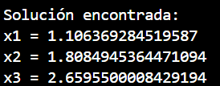

# 📘 Interpolación y Ajuste de Datos

Este repositorio forma parte del curso de **Métodos Numéricos** y contiene ejercicios prácticos relacionados con la **interpolación de datos**, **regresión**, **correlación** y el método de **mínimos cuadrados**. Estos métodos son esenciales para estimar valores, construir modelos y analizar relaciones entre variables.

---

## 📑 Índice

- [📄 Descripción del Problemario](#descripcion-del-problemario)
- [📚 Sobre la Materia](#sobre-la-materia)
  - [🎯 Competencia de la Asignatura](#competencia-de-la-asignatura)
  - [🔍 Competencia del Tema](#competencia-del-tema)
  - [📌 Temario](#temario)
- [📈 Métodos Implementados](#metodos-implementados)
  - [🔹 Interpolación Lineal](#interpolacion-lineal)
  - [🔸 Interpolación Polinómica (de Lagrange)](#interpolacion-polinomica)
  - [📊 Regresión Lineal y No Lineal](#regresion-lineal-y-no-lineal)
  - [📉 Correlación](#correlacion)
  - [📐 Mínimos Cuadrados](#minimos-cuadrados)

---

## 📄 Descripción del Problemario <a name="descripcion-del-problemario"></a>

Este tema aborda herramientas matemáticas para **estimar valores intermedios**, **ajustar modelos a datos experimentales** y **analizar relaciones entre variables**. Se implementan soluciones computacionales en Java para:

- Estimar puntos intermedios a partir de datos (interpolación).
- Ajustar funciones a datos observados (regresión).
- Evaluar la fuerza de una relación lineal entre variables (correlación).
- Minimizar el error en modelos de predicción (mínimos cuadrados).

---

## 📚 Sobre la Materia <a name="sobre-la-materia"></a>

### 🎯 Competencia de la Asignatura <a name="competencia-de-la-asignatura"></a>

Aplicar métodos numéricos para resolver problemas científicos y de ingeniería utilizando la computadora.

### 🔍 Competencia del Tema <a name="competencia-del-tema"></a>

Ajustar curvas e interpolar valores mediante técnicas numéricas para modelar fenómenos a partir de datos experimentales.

### 📌 Temario <a name="temario"></a>

- Interpolación Lineal  
- Interpolación Polinómica (Lagrange)  
- Regresión Lineal y No Lineal  
- Correlación  
- Mínimos Cuadrados

---

## 📈 Métodos Implementados <a name="metodos-implementados"></a>

### 🔹 Interpolación Lineal <a name="interpolacion-lineal"></a>

**Descripción:**  
Permite estimar un valor `y` para un `x` dado entre dos puntos conocidos.

**Fórmula:**  
Si se conocen dos puntos `(x₀, y₀)` y `(x₁, y₁)`, el valor estimado `y` para `x` es:  
y ≈ y₀ + ( (x - x₀) * (y₁ - y₀) ) / (x₁ - x₀)

**Pseudocódigo**
```plaintext
Inicio
    Definir función interpolacionLineal(x0, y0, x1, y1, x):
        Si x0 == x1 entonces
            Lanzar excepción "Los valores x0 y x1 no pueden ser iguales (evitar división por cero)"
        FinSi

        pendiente = (y1 - y0) / (x1 - x0)
        terminoIndependiente = y0 - pendiente * x0

        Retornar pendiente * x + terminoIndependiente

    En el programa principal:
        Definir x0 = 1.0, y0 = 2.0
        Definir x1 = 3.0, y1 = 6.0
        Definir x = 2.0

        Intentar:
            y = interpolacionLineal(x0, y0, x1, y1, x)
            Imprimir "Para x = " + x + ", y ≈ " + y (formateado a 3 decimales)

            // Caso adicional
            y_adicional = interpolacionLineal(x0, y0, x1, y1, 1.5)
            Imprimir "Para x = 1.5, y ≈ " + y_adicional (formateado a 3 decimales)

        Capturar excepción:
            Imprimir "Error: " + mensaje de la excepción
Fin
```

**Código en java:**  
```java
import java.text.DecimalFormat;

public class InterpolacionLineal {

    public static double interpolacionLineal(double x0, double y0, double x1, double y1, double x) {
        // Validar que los puntos x sean diferentes
        if (x0 == x1) {
            throw new IllegalArgumentException("Los valores x0 y x1 no pueden ser iguales (evitar división por cero)");
        }
        
        // Calcular pendiente (m) y término independiente (b) de la recta y = mx + b
        double pendiente = (y1 - y0) / (x1 - x0);
        double terminoIndependiente = y0 - pendiente * x0;
        
        // Calcular y retornar valor interpolado
        return pendiente * x + terminoIndependiente;
    }

    public static void main(String[] args) {
        // Ejemplo de uso
        double x0 = 1.0, y0 = 2.0;
        double x1 = 3.0, y1 = 6.0;
        double x = 2.0;
        
        // Formateador para 3 decimales
        DecimalFormat df = new DecimalFormat("0.000");
        
        try {
            double y = interpolacionLineal(x0, y0, x1, y1, x);
            System.out.println("Para x = " + x + ", y ≈ " + df.format(y));
            
            // Caso de prueba adicional
            System.out.println("Para x = 1.5, y ≈ " + df.format(interpolacionLineal(x0, y0, x1, y1, 1.5)));
            
        } catch (IllegalArgumentException e) {
            System.out.println("Error: " + e.getMessage());
        }
    }
}
```


**Casos de prueba**


### 🔸 Interpolación Polinómica (de Lagrange) <a name="interpolacion-polinomica"></a>

**Descripción:**  
Calcula un polinomio que pasa exactamente por un conjunto de puntos dados.
 
**Fórmula:**  
P(x) = Σ [ yᵢ * Lᵢ(x) ]  
Lᵢ(x) = Π [ (x - xⱼ) / (xᵢ - xⱼ) ], para j ≠ i

**Pseudocódigo**
```plaintext
Inicio
    Definir función lagrange(x[], y[], valor):
        Si longitud(x) != longitud(y) entonces
            Lanzar excepción "Los arrays x e y deben tener la misma longitud"
        FinSi

        Si longitud(x) < 2 entonces
            Lanzar excepción "Se requieren al menos 2 puntos para la interpolación"
        FinSi

        resultado = 0.0

        Para i desde 0 hasta longitud(x)-1 hacer:
            termino = y[i]

            Para j desde 0 hasta longitud(x)-1 hacer:
                Si i != j entonces
                    Si x[i] == x[j] entonces
                        Lanzar excepción "Los valores x no pueden repetirse (x[i] = x[j] = valor)"
                    FinSi
                    termino = termino * (valor - x[j]) / (x[i] - x[j])
                FinSi
            FinPara

            resultado = resultado + termino
        FinPara

        Retornar resultado

    En el programa principal:
        Definir x = [1.0, 2.0, 4.0, 5.0]
        Definir y = [1.0, 4.0, 16.0, 25.0]
        Definir valor = 3.0

        Intentar:
            yInterpolado = lagrange(x, y, valor)
            Imprimir "Interpolación en x = " + valor + " → y = " + yInterpolado (formateado a 5 decimales)

            // Prueba adicional
            yInterpoladoAdicional = lagrange(x, y, 2.5)
            Imprimir "Interpolación en x = 2.5 → y = " + yInterpoladoAdicional (formateado a 5 decimales)

        Capturar excepción:
            Imprimir "Error: " + mensaje de la excepción
Fin
```

**Código en java:**  
```java
import java.text.DecimalFormat;

public class InterpolacionLagrange {

    public static double lagrange(double[] x, double[] y, double valor) {
        // Validación de parámetros
        if (x.length != y.length) {
            throw new IllegalArgumentException("Los arrays x e y deben tener la misma longitud");
        }
        if (x.length < 2) {
            throw new IllegalArgumentException("Se requieren al menos 2 puntos para la interpolación");
        }

        double resultado = 0.0;
        
        for (int i = 0; i < x.length; i++) {
            double termino = y[i];
            
            for (int j = 0; j < x.length; j++) {
                if (i != j) {
                    // Verificar división por cero
                    if (x[i] == x[j]) {
                        throw new IllegalArgumentException("Los valores x no pueden repetirse (x[" + i + "] = x[" + j + "] = " + x[i] + ")");
                    }
                    termino *= (valor - x[j]) / (x[i] - x[j]);
                }
            }
            
            resultado += termino;
        }
        
        return resultado;
    }

    public static void main(String[] args) {
        // Datos de ejemplo
        double[] x = {1.0, 2.0, 4.0, 5.0};
        double[] y = {1.0, 4.0, 16.0, 25.0};
        double valor = 3.0;
        
        // Formateador para 5 decimales
        DecimalFormat df = new DecimalFormat("0.00000");
        
        try {
            double yInterpolado = lagrange(x, y, valor);
            System.out.println("Interpolación en x = " + valor + " → y = " + df.format(yInterpolado));
            
            // Prueba adicional
            System.out.println("Interpolación en x = 2.5 → y = " + df.format(lagrange(x, y, 2.5)));
            
        } catch (IllegalArgumentException e) {
            System.out.println("Error: " + e.getMessage());
        }
    }
}
```


**Casos de prueba**


### 📊 Regresión Lineal y No Lineal <a name="regresion-lineal-y-no-lineal"></a>

**Descripción:**  
Busca la recta o curva que mejor ajusta un conjunto de datos observados.
 
**Fórmula:**  
b = (nΣxy - ΣxΣy) / (nΣx² - (Σx)²)  
a = (Σy - bΣx) / n

**Pseudocódigo**
```plaintext
Inicio
    Definir función regresionLineal(x[], y[]):
        Si longitud(x) != longitud(y) entonces
            Lanzar excepción "Los arrays x e y deben tener la misma longitud"
        FinSi

        Si longitud(x) == 0 entonces
            Lanzar excepción "Los arrays no pueden estar vacíos"
        FinSi

        Si longitud(x) < 2 entonces
            Lanzar excepción "Se requieren al menos 2 puntos para la regresión"
        FinSi

        n = longitud(x)
        sumX = 0, sumY = 0, sumXY = 0, sumX2 = 0

        Para i desde 0 hasta n-1 hacer:
            sumX += x[i]
            sumY += y[i]
            sumXY += x[i] * y[i]
            sumX2 += x[i] * x[i]
        FinPara

        denominador = n * sumX2 - sumX * sumX
        Si denominador == 0 entonces
            Lanzar excepción "Los datos x no pueden ser todos iguales (varianza cero)"
        FinSi

        b = (n * sumXY - sumX * sumY) / denominador
        a = (sumY - b * sumX) / n

        Retornar [redondear(a, 5), redondear(b, 5)]

    Definir función redondear(valor, decimales):
        factor = 10^decimales
        Retornar redondear(valor * factor) / factor

    Definir función calcularR2(x[], y[], a, b):
        ssTotal = 0
        ssResidual = 0
        yMean = promedio de y

        Para i desde 0 hasta longitud(y)-1 hacer:
            yPred = a + b * x[i]
            ssTotal += (y[i] - yMean)^2
            ssResidual += (y[i] - yPred)^2
        FinPara

        Retornar 1 - (ssResidual / ssTotal)

    En el programa principal:
        Definir x = [1, 2, 3, 4, 5]
        Definir y = [5, 8, 11, 14, 17]

        Intentar:
            coeficientes = regresionLineal(x, y)
            Imprimir "Ecuación de regresión:"
            Imprimir "y = " + coeficientes[0] + " + " + coeficientes[1] + "x"

            r2 = calcularR2(x, y, coeficientes[0], coeficientes[1])
            Imprimir "Coeficiente de determinación R² = " + r2
        Capturar excepción:
            Imprimir "Error: " + mensaje de la excepción
Fin
```

**Código en java:**  
```java
import java.text.DecimalFormat;

public class RegresionLineal {

    public static double[] regresionLineal(double[] x, double[] y) {
        // Validaciones iniciales
        if (x.length != y.length) {
            throw new IllegalArgumentException("Los arrays x e y deben tener la misma longitud");
        }
        if (x.length == 0) {
            throw new IllegalArgumentException("Los arrays no pueden estar vacíos");
        }
        if (x.length < 2) {
            throw new IllegalArgumentException("Se requieren al menos 2 puntos para la regresión");
        }

        int n = x.length;
        double sumX = 0, sumY = 0, sumXY = 0, sumX2 = 0;

        // Calcular sumatorias
        for (int i = 0; i < n; i++) {
            sumX += x[i];
            sumY += y[i];
            sumXY += x[i] * y[i];
            sumX2 += x[i] * x[i];
        }

        // Calcular denominador para verificar colinealidad
        double denominador = n * sumX2 - sumX * sumX;
        if (denominador == 0) {
            throw new IllegalArgumentException("Los datos x no pueden ser todos iguales (varianza cero)");
        }

        // Calcular coeficientes
        double b = (n * sumXY - sumX * sumY) / denominador;
        double a = (sumY - b * sumX) / n;

        return new double[]{redondear(a, 5), redondear(b, 5)};
    }

    /**
     * Redondea un valor al número de decimales especificado
     */
    private static double redondear(double valor, int decimales) {
        double factor = Math.pow(10, decimales);
        return Math.round(valor * factor) / factor;
    }

    public static void main(String[] args) {
        // Datos de ejemplo (y = 2 + 3x)
        double[] x = {1, 2, 3, 4, 5};
        double[] y = {5, 8, 11, 14, 17};

        try {
            double[] coeficientes = regresionLineal(x, y);
            System.out.println("Ecuación de regresión:");
            System.out.printf("y = %.5f + %.5fx%n", coeficientes[0], coeficientes[1]);
            
            // Calcular R²
            double r2 = calcularR2(x, y, coeficientes[0], coeficientes[1]);
            System.out.printf("Coeficiente de determinación R² = %.5f%n", r2);
            
        } catch (IllegalArgumentException e) {
            System.out.println("Error: " + e.getMessage());
        }
    }

    /**
     * Calcula el coeficiente de determinación R²
     */
    private static double calcularR2(double[] x, double[] y, double a, double b) {
        double ssTotal = 0;
        double ssResidual = 0;
        double yMean = 0;
        
        for (double yi : y) {
            yMean += yi;
        }
        yMean /= y.length;

        for (int i = 0; i < y.length; i++) {
            double yPred = a + b * x[i];
            ssTotal += Math.pow(y[i] - yMean, 2);
            ssResidual += Math.pow(y[i] - yPred, 2);
        }

        return 1 - (ssResidual / ssTotal);
    }
}
```


**Casos de prueba**


### 📉 Correlación <a name="correlacion"></a>

**Descripción:**  
Mide la fuerza y dirección de la relación lineal entre dos variables.

**Fórmula:**  
r = (nΣxy - ΣxΣy) / sqrt[(nΣx² - (Σx)²)(nΣy² - (Σy)²)]
Interpretación:

r ≈ 1: Correlación positiva fuerte

r ≈ -1: Correlación negativa fuerte

r ≈ 0: Sin correlación lineal

**Pseudocódigo**
```plaintext
Inicio
    Definir función correlacion(x[], y[]):
        Si longitud(x) != longitud(y) entonces
            Lanzar excepción "Los arrays x e y deben tener la misma longitud"
        FinSi

        Si longitud(x) == 0 entonces
            Lanzar excepción "Los arrays no pueden estar vacíos"
        FinSi

        Si longitud(x) < 2 entonces
            Lanzar excepción "Se requieren al menos 2 puntos para calcular correlación"
        FinSi

        n = longitud(x)
        sumX = 0, sumY = 0, sumXY = 0, sumX2 = 0, sumY2 = 0

        Para i desde 0 hasta n-1 hacer:
            sumX += x[i]
            sumY += y[i]
            sumXY += x[i] * y[i]
            sumX2 += x[i] * x[i]
            sumY2 += y[i] * y[i]
        FinPara

        numerator = n * sumXY - sumX * sumY
        denomX = n * sumX2 - sumX * sumX
        denomY = n * sumY2 - sumY * sumY

        Si denomX == 0 o denomY == 0 entonces
            Lanzar excepción "No se puede calcular correlación cuando un variable es constante"
        FinSi

        denominator = raíz cuadrada (denomX * denomY)
        r = numerator / denominator

        // Asegurar que r esté en [-1, 1] debido a errores de redondeo
        r = máximo(-1.0, mínimo(1.0, r))

        Retornar redondear(r, 4)

    Definir función redondear(valor, decimales):
        factor = 10^decimales
        Retornar redondear(valor * factor) / factor

    En el programa principal:
        Definir arrays:
            x1 = [1, 2, 3, 4, 5]
            y1 = [2, 4, 6, 8, 10]

            x2 = [1, 2, 3, 4, 5]
            y2 = [10, 8, 6, 4, 2]

            x3 = [1, 2, 3, 4, 5]
            y3 = [2, 3, 2, 3, 2]

            altura = [1.65, 1.70, 1.75, 1.80, 1.85]
            peso = [58, 62, 70, 72, 80]

        Intentar:
            Imprimir "Correlación positiva:" + correlacion(x1, y1)
            Imprimir "Correlación negativa:" + correlacion(x2, y2)
            Imprimir "Sin correlación:" + correlacion(x3, y3)
            Imprimir "Correlación altura-peso:" + correlacion(altura, peso)
        Capturar excepción:
            Imprimir "Error:" + mensaje de la excepción
Fin
```

**Código en java:**  
```java
import java.text.DecimalFormat;

public class AnalisisCorrelacion {

    public static double correlacion(double[] x, double[] y) {
        // Validaciones iniciales
        if (x.length != y.length) {
            throw new IllegalArgumentException("Los arrays x e y deben tener la misma longitud");
        }
        if (x.length == 0) {
            throw new IllegalArgumentException("Los arrays no pueden estar vacíos");
        }
        if (x.length < 2) {
            throw new IllegalArgumentException("Se requieren al menos 2 puntos para calcular correlación");
        }

        int n = x.length;
        double sumX = 0, sumY = 0, sumXY = 0, sumX2 = 0, sumY2 = 0;

        // Calcular sumatorias
        for (int i = 0; i < n; i++) {
            sumX += x[i];
            sumY += y[i];
            sumXY += x[i] * y[i];
            sumX2 += x[i] * x[i];
            sumY2 += y[i] * y[i];
        }

        // Calcular numerador y denominador
        double numerator = n * sumXY - sumX * sumY;
        double denomX = n * sumX2 - sumX * sumX;
        double denomY = n * sumY2 - sumY * sumY;

        // Validar casos especiales
        if (denomX == 0 || denomY == 0) {
            throw new IllegalArgumentException("No se puede calcular correlación cuando un variable es constante");
        }

        double denominator = Math.sqrt(denomX * denomY);
        double r = numerator / denominator;

        // Redondear y asegurar valor dentro del rango [-1, 1] por posibles errores de redondeo
        r = Math.max(-1.0, Math.min(1.0, r));
        return redondear(r, 4);
    }

    /**
     * Redondea un valor al número de decimales especificado
     */
    private static double redondear(double valor, int decimales) {
        double factor = Math.pow(10, decimales);
        return Math.round(valor * factor) / factor;
    }

    public static void main(String[] args) {
        // Ejemplo con correlación positiva perfecta
        double[] x1 = {1, 2, 3, 4, 5};
        double[] y1 = {2, 4, 6, 8, 10};
        
        // Ejemplo con correlación negativa
        double[] x2 = {1, 2, 3, 4, 5};
        double[] y2 = {10, 8, 6, 4, 2};
        
        // Ejemplo sin correlación
        double[] x3 = {1, 2, 3, 4, 5};
        double[] y3 = {2, 3, 2, 3, 2};

        try {
            System.out.println("Correlación positiva: " + correlacion(x1, y1));
            System.out.println("Correlación negativa: " + correlacion(x2, y2));
            System.out.println("Sin correlación: " + correlacion(x3, y3));
            
            // Prueba con datos reales
            double[] altura = {1.65, 1.70, 1.75, 1.80, 1.85};
            double[] peso = {58, 62, 70, 72, 80};
            System.out.println("\nCorrelación altura-peso: " + correlacion(altura, peso));
            
        } catch (IllegalArgumentException e) {
            System.out.println("Error: " + e.getMessage());
        }
    }
}
```


**Casos de prueba**


### 📐 Mínimos Cuadrados <a name="minimos-cuadrados"></a>

**Descripción:**  
Minimiza el error cuadrático total entre los puntos y una curva ajustada.

**Fórmula:**  
E = Σ (yᵢ - (a + bxᵢ))²
Se aplica tanto a funciones lineales como polinomios de grado n o exponenciales (con transformaciones). 

**Pseudocódigo**
```plaintext
Inicio
    Definir función minimosCuadrados(x[], y[]):
        Si x es nulo o y es nulo entonces
            Lanzar excepción "Los arrays no pueden ser nulos"
        FinSi

        Si longitud(x) != longitud(y) entonces
            Lanzar excepción "Los arrays deben tener la misma longitud"
        FinSi

        Si longitud(x) < 2 entonces
            Lanzar excepción "Se requieren al menos 2 puntos para la regresión"
        FinSi

        n = longitud(x)
        sumX = 0, sumY = 0, sumXY = 0, sumX2 = 0

        Para i desde 0 hasta n-1 hacer:
            sumX += x[i]
            sumY += y[i]
            sumXY += x[i] * y[i]
            sumX2 += x[i] * x[i]
        FinPara

        denominador = n * sumX2 - sumX * sumX
        Si denominador == 0 entonces
            Lanzar excepción "Los datos de x no pueden ser todos iguales"
        FinSi

        b = (n * sumXY - sumX * sumY) / denominador
        a = (sumY - b * sumX) / n

        Retornar [redondear(a, 4), redondear(b, 4)]

    Definir función redondear(valor, decimales):
        factor = 10^decimales
        Retornar redondear(valor * factor) / factor

    Definir función calcularR2(x[], y[], a, b):
        ssTotal = 0
        ssResidual = 0
        yPromedio = promedio de y

        Para i desde 0 hasta longitud(y)-1 hacer:
            yPredicho = a + b * x[i]
            ssTotal += (y[i] - yPromedio)^2
            ssResidual += (y[i] - yPredicho)^2
        FinPara

        Retornar 1 - (ssResidual / ssTotal)

    En el programa principal:
        Definir x = [1, 2, 3, 4, 5]
        Definir y = [5, 8, 11, 14, 17]

        Intentar:
            coeficientes = minimosCuadrados(x, y)
            Imprimir "Ecuación de regresión:"
            Imprimir "y = " + coeficientes[0] + " + " + coeficientes[1] + "x"

            r2 = calcularR2(x, y, coeficientes[0], coeficientes[1])
            Imprimir "Coeficiente de determinación (R²): " + r2

            prediccion = coeficientes[0] + coeficientes[1] * 6
            Imprimir "Predicción para x=6: y = " + prediccion
        Capturar excepción:
            Imprimir "Error: " + mensaje de la excepción
Fin
```

**Código en java:**  
```java
import java.text.DecimalFormat;

public class RegresionMinimosCuadrados {

    public static double[] minimosCuadrados(double[] x, double[] y) {
        // Validaciones iniciales
        if (x == null || y == null) {
            throw new IllegalArgumentException("Los arrays no pueden ser nulos");
        }
        if (x.length != y.length) {
            throw new IllegalArgumentException("Los arrays deben tener la misma longitud");
        }
        if (x.length < 2) {
            throw new IllegalArgumentException("Se requieren al menos 2 puntos para la regresión");
        }

        int n = x.length;
        double sumX = 0, sumY = 0, sumXY = 0, sumX2 = 0;

        // Calcular sumatorias
        for (int i = 0; i < n; i++) {
            sumX += x[i];
            sumY += y[i];
            sumXY += x[i] * y[i];
            sumX2 += x[i] * x[i];
        }

        // Calcular denominador (evitar división por cero)
        double denominador = n * sumX2 - sumX * sumX;
        if (denominador == 0) {
            throw new IllegalArgumentException("Los datos de x no pueden ser todos iguales");
        }

        // Calcular coeficientes
        double b = (n * sumXY - sumX * sumY) / denominador;
        double a = (sumY - b * sumX) / n;

        // Redondear a 4 decimales
        return new double[]{redondear(a, 4), redondear(b, 4)};
    }

    /**
     * Redondea un valor al número de decimales especificado
     */
    private static double redondear(double valor, int decimales) {
        double factor = Math.pow(10, decimales);
        return Math.round(valor * factor) / factor;
    }

    public static void main(String[] args) {
        // Datos de ejemplo (y = 2 + 3x)
        double[] x = {1, 2, 3, 4, 5};
        double[] y = {5, 8, 11, 14, 17};

        try {
            double[] coeficientes = minimosCuadrados(x, y);
            System.out.println("Ecuación de regresión:");
            System.out.printf("y = %.4f + %.4fx%n", coeficientes[0], coeficientes[1]);

            // Calcular y mostrar R²
            double r2 = calcularR2(x, y, coeficientes[0], coeficientes[1]);
            System.out.printf("Coeficiente de determinación (R²): %.4f%n", r2);

            // Predicción para x = 6
            double prediccion = coeficientes[0] + coeficientes[1] * 6;
            System.out.printf("Predicción para x=6: y = %.4f%n", prediccion);

        } catch (IllegalArgumentException e) {
            System.out.println("Error: " + e.getMessage());
        }
    }

    /**
     * Calcula el coeficiente de determinación R²
     */
    private static double calcularR2(double[] x, double[] y, double a, double b) {
        double ssTotal = 0;
        double ssResidual = 0;
        double yPromedio = 0;

        // Calcular promedio de y
        for (double yi : y) {
            yPromedio += yi;
        }
        yPromedio /= y.length;

        // Calcular sumas de cuadrados
        for (int i = 0; i < y.length; i++) {
            double yPredicho = a + b * x[i];
            ssTotal += Math.pow(y[i] - yPromedio, 2);
            ssResidual += Math.pow(y[i] - yPredicho, 2);
        }

        return 1 - (ssResidual / ssTotal);
    }
}
```


**Casos de prueba**

