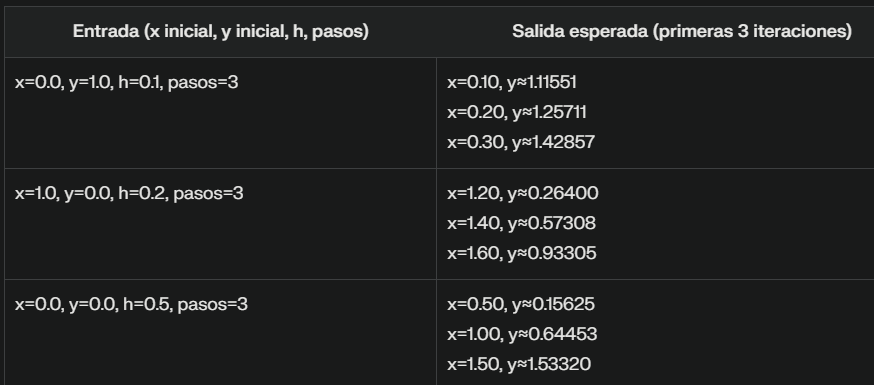
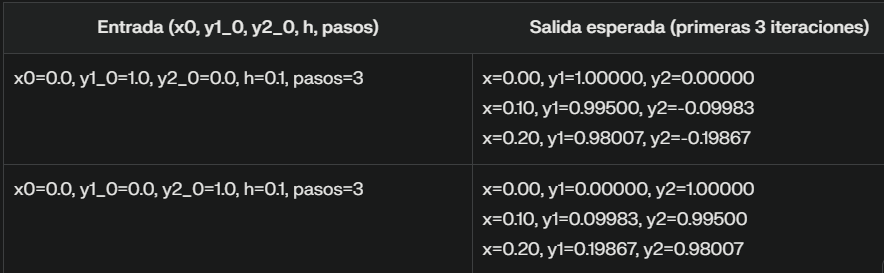
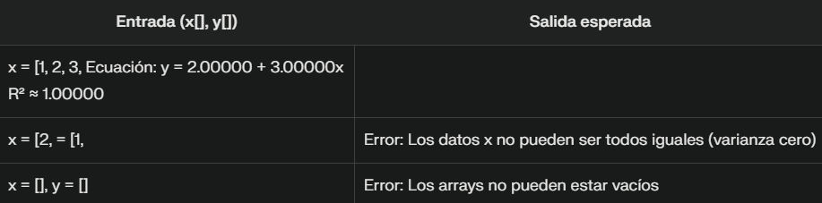

# 📘 Solución de Ecuaciones

Este repositorio contiene una recopilación de ejercicios desarrollados como parte del curso de **Métodos Numéricos**, específicamente enfocados en la **solución de ecuaciones no lineales** mediante métodos numéricos. Aquí encontrarás implementaciones, explicaciones y ejemplos prácticos en Java para los métodos más utilizados.

---

## 📑 Índice

- [📄 Descripción del Problemario](#descripcion-del-problemario)
- [📚 Sobre la Materia](#sobre-la-materia)
  - [🎯 Competencia de la Asignatura](#competencia-de-la-asignatura)
  - [🔍 Competencia del Tema](#competencia-del-tema)
  - [📌 Temario](#temario)
- [🧮 Métodos Numéricos para Encontrar las Raíces](#metodos-numericos-para-encontrar-las-raices)
  - [📏 Método de Bisección](#metodo-de-biseccion)
  - [📐 Método de la Falsa Posición](#metodo-de-la-falsa-posicion)
  - [📈 Método de la Secante](#metodo-de-la-secante)
  - [⚡ Método de Newton-Raphson](#metodo-de-newton-raphson)
- [👨‍💻 Autor](#autor)

---

## 📄 Descripción del Problemario <a name="descripcion-del-problemario"></a>

En esta sección se presentan diversos ejercicios implementados en Java para resolver ecuaciones no lineales, utilizando los siguientes métodos numéricos:

1. 📏 **Bisección**
2. 📐 **Falsa Posición**
3. 📈 **Secante**
4. ⚡ **Newton-Raphson**

Cada ejercicio incluye descripción, pasos generales del método, y el código correspondiente.

---

## 📚 Sobre la Materia <a name="sobre-la-materia"></a>

### 🎯 Competencia de la Asignatura <a name="competencia-de-la-asignatura"></a>

Aplicar métodos numéricos para resolver problemas científicos y de ingeniería utilizando la computadora.

### 🔍 Competencia del Tema <a name="competencia-del-tema"></a>

Utilizar métodos numéricos con el objetivo de solucionar ecuaciones mediante técnicas de intervalo e interpolación, apoyándose en un lenguaje de programación.

### 📌 Temario <a name="temario"></a>

- Método de Bisección
- Método de Falsa Posición
- Método de la Secante
- Método de Newton-Raphson

---

## 🧮 Métodos Numéricos para Encontrar las Raíces <a name="metodos-numericos-para-encontrar-las-raices"></a>

### 📏 Método de Bisección <a name="metodo-de-biseccion"></a>

**Descripción:**  
El método de bisección es una técnica iterativa que permite encontrar una raíz dentro de un intervalo en el cual la función cambia de signo. Se basa en dividir repetidamente el intervalo a la mitad hasta alcanzar la precisión deseada.

**Pasos Generales:**
1. Definir un intervalo `[a, b]` donde `f(a) * f(b) < 0`.
2. Calcular el punto medio `c = (a + b) / 2`.
3. Evaluar `f(c)` y determinar el nuevo subintervalo.
4. Repetir hasta que el error sea menor al permitido.

**Pseudocódigo:**

```plaintext
Algoritmo MétodoDeBisección
    Inicio
        Intentar
            raíz <- Bisección(0, 3, 0.000001)
            Escribir "La raíz encontrada es: " + Formatear(raíz, "%.3f")
        Capturar excepción (IllegalArgumentException e)
            Escribir e.mensaje
        Fin intentar
    Fin

Función Bisección(a, b, error) -> real
    Inicio
        Si f(a) * f(b) >= 0 entonces
            Lanzar nueva excepción "La función debe tener signos opuestos en los extremos del intervalo"
        Fin si
        
        Mientras |b - a| > error hacer
            c <- (a + b) / 2
            fc <- f(c)
            
            Si |fc| < 0.000000000001 entonces
                Retornar c
            Fin si
            
            Si f(a) * fc < 0 entonces
                b <- c
            Sino
                a <- c
            Fin si
        Fin mientras
        
        Retornar (a + b) / 2
    Fin función

Función f(x) -> real
    Inicio
        Retornar x * x - 4
    Fin función
```

**Código en Java:**
```java
// Bisección en Java
public class BisectionMethod {
    public static void main(String[] args) {
        try {
            double root = bisection(0, 3, 1e-6);
            System.out.println("La raíz encontrada es: " + String.format("%.3f", root)); // Trunca a 3 decimales
        } catch (IllegalArgumentException e) {
            System.out.println(e.getMessage());
        }
    }

    public static double bisection(double a, double b, double error) {
        if (f(a) * f(b) >= 0) {
            throw new IllegalArgumentException("La función debe tener signos opuestos en los extremos del intervalo");
        }
        
        while (Math.abs(b - a) > error) {
            double c = (a + b) / 2;
            double fc = f(c);
            
            if (Math.abs(fc) < 1e-12) {
                return c;
            }
            
            if (f(a) * fc < 0) {
                b = c;
            } else {
                a = c;
            }
        }
        return (a + b) / 2;
    }

    public static double f(double x) {
        return x * x - 4;
    }
}
```


**Casos de prueba**


### 📐 Método de la Falsa Posición <a name="metodo-de-la-falsa-posicion"></a>

**Descripción:**  
También conocido como "regula falsi", este método mejora la convergencia del método de bisección utilizando una aproximación lineal entre los puntos del intervalo.

**Pasos Generales:**
1. Definir un intervalo `[a, b]` donde `f(a) * f(b) < 0`.
2. Calcular el punto `c` usando la fórmula de interpolación lineal.
3. Evaluar `f(c)` y determinar el nuevo subintervalo.
4. Repetir hasta que el error sea menor al permitido.

**Pseudocódigo**
```plaintext
Algoritmo MétodoFalsaPosición
    Inicio
        Intentar
            raíz <- FalsaPosición(0, 3, 0.000001)
            Escribir "Raíz encontrada: " + Formatear(raíz, "%.3f")
        Capturar excepción (IllegalArgumentException e)
            Escribir "Error: " + e.mensaje
        Fin intentar
    Fin

Función FalsaPosición(a, b, error) -> real
    Inicio
        Si f(a) * f(b) >= 0 entonces
            Lanzar nueva excepción "La función no cambia de signo en [a, b]."
        Fin si
        
        c <- a  // Inicialización
        
        Mientras |f(c)| > error hacer
            // Fórmula de la falsa posición
            c <- (a * f(b) - b * f(a)) / (f(b) - f(a))
            
            Si |f(c)| < 0.000000000001 entonces
                Terminar bucle
            Fin si
            
            Si f(a) * f(c) < 0 entonces
                b <- c  // La raíz está en [a, c]
            Sino
                a <- c  // La raíz está en [c, b]
            Fin si
        Fin mientras
        
        Retornar c
    Fin función

Función f(x) -> real
    Inicio
        Retornar x * x - 4  // Ejemplo: f(x) = x² - 4
    Fin función
```

**Código en Java:**
```java
// Falsa Posición en Java
public class FalsePositionMethod {

    public static void main(String[] args) {
        try {
            // Llamamos al método falsePosition con intervalo [0, 3] y error máximo 1e-6
            double root = falsePosition(0, 3, 1e-6);
            // Mostramos el resultado formateado a 3 decimales
            System.out.println("Raíz encontrada: " + String.format("%.3f", root));
        } catch (IllegalArgumentException e) {
            // Capturamos y mostramos errores de intervalo inválido
            System.out.println("Error: " + e.getMessage());
        }
    }

    public static double falsePosition(double a, double b, double error) {
        // Verificamos que haya cambio de signo en los extremos del intervalo
        if (f(a) * f(b) >= 0) {
            throw new IllegalArgumentException("La función no cambia de signo en [a, b].");
        }

        double c = a; // Inicializamos el punto de aproximación

        // Iteramos hasta que el valor absoluto de f(c) sea menor que el error
        while (Math.abs(f(c)) > error) {
            // Calculamos el nuevo punto c usando la fórmula de la falsa posición
            c = (a * f(b) - b * f(a)) / (f(b) - f(a));

            // Si f(c) es prácticamente cero, terminamos la iteración
            if (Math.abs(f(c)) < 1e-12) {
                break;
            }

            // Actualizamos el intervalo según el signo de f(c)
            if (f(a) * f(c) < 0) {
                b = c; // La raíz está en el subintervalo izquierdo [a, c]
            } else {
                a = c; // La raíz está en el subintervalo derecho [c, b]
            }
        }

        return c; // Devolvemos la aproximación final de la raíz
    }

    public static double f(double x) {
        return x * x - 4; // Ejemplo: f(x) = x² - 4 (raíces en x=2 y x=-2)
    }
}
```


**Casos de prueba**


### 📈 Método de la Secante  <a name="metodo-de-la-secante"></a>

**Descripción:**  
El método de la secante es una variante del método de Newton-Raphson que no requiere el cálculo de la derivada. Utiliza una aproximación basada en dos puntos anteriores.

**Pasos Generales:**
1. Seleccionar dos puntos iniciales x0 y x1.
2. Calcular el siguiente punto usando la fórmula de la secante.
3. Actualizar los puntos anteriores con los nuevos valores.
4. Repetir hasta que el error sea menor al permitido.

**Pseudocódigo**
```plaintext
Algoritmo MétodoSecante
    Inicio
        Intentar
            x0 ← 1.0       // Primera aproximación inicial
            x1 ← 3.0       // Segunda aproximación inicial
            error ← 0.000001  // Tolerancia de error
            
            raíz ← Secante(x0, x1, error)
            Escribir "Raíz encontrada: " + Formatear(raíz, "%.3f")
            
        Capturar excepción (IllegalArgumentException e)
            Escribir "Error: " + e.mensaje
        Capturar excepción (ArithmeticException e)
            Escribir "Error matemático: " + e.mensaje
        Fin intentar
    Fin

Función Secante(x0, x1, error) → real
    Inicio
        Si x0 == x1 entonces
            Lanzar nueva excepción "x0 y x1 no pueden ser iguales."
        Fin si
        
        x2 ← 0.0  // Inicialización de la nueva aproximación
        
        Repetir
            denominador ← f(x1) - f(x0)
            
            Si |denominador| < 0.000000000001 entonces
                Lanzar nueva excepción "División por cero (f(x1) ≈ f(x0))."
            Fin si
            
            // Fórmula del método de la secante
            x2 ← x1 - (f(x1) * (x1 - x0)) / denominador
            
            // Actualizar valores para la siguiente iteración
            x0 ← x1
            x1 ← x2
            
        Hasta que |f(x2)| ≤ error
        
        Retornar x2
    Fin función

Función f(x) → real
    Inicio
        Retornar x * x - 4  // Ejemplo: f(x) = x² - 4 (raíces en x=2 y x=-2)
    Fin función
```

**Código en Java:**
```java
// Secante en Java
public class SecantMethod {

    public static void main(String[] args) {
        try {
            // Definimos las aproximaciones iniciales y el error tolerado
            double x0 = 1.0;  // Primera aproximación inicial
            double x1 = 3.0;  // Segunda aproximación inicial
            double error = 1e-6;  // Tolerancia de error

            // Llamamos al método de la secante
            double root = secant(x0, x1, error);

            // Mostramos el resultado formateado
            System.out.println("Raíz encontrada: " + String.format("%.3f", root));
        } catch (IllegalArgumentException e) {
            System.out.println("Error: " + e.getMessage());
        } catch (ArithmeticException e) {
            System.out.println("Error matemático: " + e.getMessage());
        }
    }

    public static double secant(double x0, double x1, double error) {
        // Verificar que las aproximaciones iniciales sean distintas
        if (x0 == x1) {
            throw new IllegalArgumentException("x0 y x1 no pueden ser iguales.");
        }

        double x2;  // Almacenará la nueva aproximación

        do {
            // Calcular diferencia entre f(x1) y f(x0)
            double denominator = f(x1) - f(x0);

            // Evitar división por cero
            if (Math.abs(denominator) < 1e-12) {
                throw new ArithmeticException("División por cero (f(x1) ≈ f(x0)).");
            }

            // Fórmula de la secante: x2 = x1 - f(x1)*(x1 - x0)/(f(x1) - f(x0))
            x2 = x1 - (f(x1) * (x1 - x0)) / denominator;

            // Actualizar valores para la siguiente iteración
            x0 = x1;
            x1 = x2;

        } while (Math.abs(f(x2)) > error);  // Continuar hasta alcanzar la precisión deseada

        return x2;
    }

    public static double f(double x) {
        return x * x - 4;
    }
}
```


**Casos de prueba**


### ⚡ Método de Newton-Raphson <a name="metodo-de-newton-raphson"></a>

**Descripción:**  
Este método iterativo utiliza la derivada de la función para converger más rápidamente a la raíz. Es uno de los métodos más eficientes cuando se tiene una buena aproximación inicial.

**Pasos Generales:**
1. Elegir un punto inicial x0.
2. Calcular el siguiente punto usando la fórmula de Newton-Raphson.
3. Repetir hasta que el error sea menor al permitido.

**Pseudocódigo**
```plaintext
Algoritmo MétodoNewtonRaphson
    Inicio
        Intentar
            x0 ← 2.5          // Aproximación inicial
            tolerancia ← 0.000001  // Error máximo permitido
            
            raíz ← NewtonRaphson(x0, tolerancia)
            Escribir "Raíz encontrada: " + Formatear(raíz, "%.6f")
            
        Capturar excepción (IllegalArgumentException e)
            Escribir "Error: " + e.mensaje
        Fin intentar
    Fin

Función NewtonRaphson(x0, error) → real
    Inicio
        x1 ← 0.0  // Inicialización de la nueva aproximación
        
        Repetir
            derivada ← df(x0)  // Evaluar la derivada en x0
            
            Si |derivada| < 0.000000000001 entonces
                Lanzar nueva excepción "Derivada cero en x = " + x0
            Fin si
            
            // Fórmula de Newton-Raphson
            x1 ← x0 - f(x0) / derivada
            
            // Actualizar la aproximación
            x0 ← x1
            
        Hasta que |f(x1)| ≤ error
        
        Retornar x1
    Fin función

// Función original f(x) = x² - 4
Función f(x) → real
    Inicio
        Retornar x * x - 4
    Fin función

// Derivada f'(x) = 2x
Función df(x) → real
    Inicio
        Retornar 2 * x
    Fin función
```

**Código en Java:**
```java
// Newton-Raphson en Java
public class NewtonRaphsonMethod {

    public static void main(String[] args) {
        try {
            double initialGuess = 2.5;  // Aproximación inicial (x₀)
            double tolerance = 1e-6;    // Tolerancia de error (1×10⁻⁶)
            
            double root = newtonRaphson(initialGuess, tolerance);
            
            System.out.println("Raíz encontrada: " + String.format("%.6f", root));
        } catch (IllegalArgumentException e) {
            System.out.println("Error: " + e.getMessage());
        }
    }

    public static double newtonRaphson(double x0, double error) {
        double x1;  // Almacenará la nueva aproximación
        
        do {
            double derivative = df(x0);
            
            // Evitar división por cero (si la derivada es cero)
            if (Math.abs(derivative) < 1e-12) {
                throw new IllegalArgumentException("Derivada cero en x = " + x0);
            }
            
            // Fórmula de Newton-Raphson: x₁ = x₀ - f(x₀)/f'(x₀)
            x1 = x0 - f(x0) / derivative;
            
            // Actualizar la aproximación para la siguiente iteración
            x0 = x1;
            
        } while (Math.abs(f(x1)) > error);  // Continuar hasta alcanzar la precisión deseada
        
        return x1;
    }

    public static double f(double x) {
        return x * x - 4;
    }

    public static double df(double x) {
        return 2 * x;
    }
}
```


**Casos de prueba**


