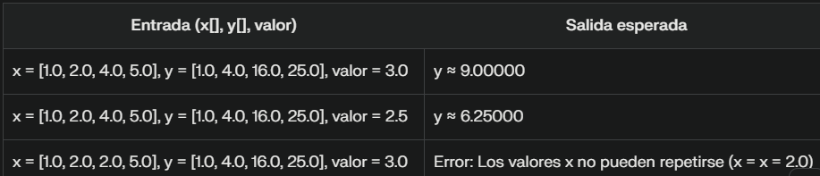

# Tema-3
<h2 align = "center">   Indice  </h2>
<header> 
                <nav class="navegacion">
                    <ul class="Indice">
                       <li> <a href="#Descripción"> Descripción del Problemario </a>   </li>
                        <li> <a href="#Sobre la materia"> Sobre la materia </a>   </li>
                            <ul class="subindice"> 
                                <li> <a href="#Competencia de la Asignatura"> Competencia de la asignatura </a> </li>
                                <li> <a href="#Competencia del tema"> Competencia del tema </a> </li>
                            </ul>
     <li> <a href="#Métodos numéricos para encontrar las raíces de ecuaciones que se encuentran en nuestro repositorio"> Sistemas de ecuaciones </a>   </li>
                            <ul class="subindice"> 
                                <li> <a href="#Eliminacion"> Eliminación-Gaussiana </a> </li>
                                <li> <a href="#Gauss"> Gauss-Jordan </a> </li>
                                <li> <a href="#Seidel"> Gauss-Seidel </a> </li> 
                                <li> <a href="#Jacobi"> Método de Jacobi </a> </li> 
                            </ul>
                    </ul>
                </nav>
             </header>
            # Descripción
En este documento vamos a ver varios ejercicios sobre los distintos metodos como lo son:
  <li>1.- Eliminación-Gaussiana</li>
  <li>2.- Gauss-Jordan</li>
  <li>3.- Gauss-Seidel</li>
  <li>4.- Jacobi</li>
  
# Sobre la materia 
<h2 align = "center">  <a name="Competencia de la Asignatura">Competencia de la asignatura</a> </h2>
Aplica los métodos numéricos para resolver problemas científicos y de ingeniería utilizando la computadora.
<h2 align = "center">  <a name="Competencia del tema">Competencia del tema </a></h2>
Aplica los métodos numéricos con el objeto de solucionar ecuaciones mediante los métodos de intervalo e interpolación apoyada de un lenguaje de programación.  
<h1 align = "center">  <a name="Sistemas de ecuaciones"> Sistemas de ecuaciones </a> </h1>

<h2 align = "center"> <a name="Eliminacion">  1. Eliminación Gaussiana </h2></a>

<h3>  DESCRIPCIÓN: </h3>

La eliminación gaussiana es un método utilizado en álgebra lineal para resolver sistemas de ecuaciones lineales de una manera sistemática y paso a paso. Este método consiste en llevar un sistema de ecuaciones a una forma matricial, convertir una matriz cuadrada en una matriz triangular superior equivalente a la original y luego resolver el sistema sustituyendo las variables en cada ecuación resultante:

<h3> Pasos de la eliminación Gaussiana:</h3>
<h5>Formar la matriz aumentada:</h5> Combinar la matriz de coeficientes y el vector de términos independientes en una sola matriz aumentada.
<h5>Pivoteo parcial: </h5> Si es necesario, intercambiar filas para asegurar que el elemento en la posición de pivote sea el mayor en valor absoluto en su columna.
<h5>Escalonar la matriz: </h5> Comenzar con la primera fila y hacer ceros debajo del elemento de pivote, utilizando operaciones elementales de fila.
<h5>Repetir el proceso: </h5> Aplicar el mismo procedimiento a las filas restantes, avanzando hacia abajo y creando ceros debajo de los pivotes.
<h5>Sustitución hacia atrás: </h5> Una vez que la matriz está en forma triangular superior, resolver el sistema de ecuaciones resultante mediante sustitución hacia atrás, empezando por la última ecuación y despejando las incógnitas hacia arriba.
<h5>Verificar la solución: </h5> Sustituir las soluciones encontradas en las ecuaciones originales para comprobar si satisfacen todas las ecuaciones del sistema.
<h5>  <b> <i> Ejemplo 1: </i> </b> </h5>

package Eliminacion_Gaussiana;

public class Ejercicio1 {

    public static void main(String[] args) {
        int n = 3; // Número de incógnitas en el sistema de ecuaciones

        // Matriz aumentada que representa el sistema de ecuaciones:
        //  2x +  y -  z =  8
        // -3x -  y + 2z = -11
        // -2x +  y + 2z = -3
        double[][] matrix = {
                {2.0, 1.0, -1.0, 8.0},
                {-3.0, -1.0, 2.0, -11.0},
                {-2.0, 1.0, 2.0, -3.0}
        };

        // Llamada al método que resuelve el sistema mediante eliminación gaussiana
        double[] result = Eliminacion(matrix, n);

        // Imprime los valores de las incógnitas obtenidas
        for (int i = 0; i < n; i++) {
            System.out.println("x[" + i + "] = " + result[i]);
        }
    }

    /**
     * Método que implementa el algoritmo de Eliminación Gaussiana
     * para resolver un sistema de ecuaciones lineales.
     */
    public static double[] Eliminacion(double[][] matrix, int n) {
        // Proceso de eliminación hacia adelante
        for (int i = 0; i < n; i++) { // Recorre cada fila
            for (int j = i + 1; j < n; j++) { // Recorre las filas inferiores
                double factor = matrix[j][i] / matrix[i][i]; // Calcula el factor de eliminación
                
                // Modifica la fila restando un múltiplo de la fila superior
                for (int k = i; k < n + 1; k++) {
                    matrix[j][k] -= factor * matrix[i][k];
                }
            }
        }

        // Proceso de sustitución regresiva para encontrar las soluciones
        double[] result = new double[n]; // Arreglo que almacenará las soluciones
        for (int i = n - 1; i >= 0; i--) { // Recorre las filas en orden inverso
            result[i] = matrix[i][n]; // Toma el valor independiente

            for (int j = i + 1; j < n; j++) { // Sustituye los valores ya calculados
                result[i] -= matrix[i][j] * result[j];
            }
            result[i] /= matrix[i][i]; // Despeja la incógnita
        }

        return result; // Retorna el conjunto de soluciones
    }
}

      
<h5>  <b> <i> Ejemplo 2: </i> </b> </h5>
package Eliminacion_Gaussiana;

public class Ejercicio2 {

      public static void main(String[] args) {
        int n = 3; // Número de incógnitas
        double[][] matrix = {
                {10, 4.0, -1.0, 8.0},
                {-7.0, -1.0, 8.0, -11.0},
                {6.0, 14.0, 0.0, -3.0}
        };
        double[] result = Eliminacion(matrix, n);
        for (int i = 0; i < n; i++) {
            System.out.println("x[" + i + "] = " + result[i]);
        }
    }

    public static double[] Eliminacion(double[][] matrix, int n) {
        for (int i = 0; i < n; i++) {
            for (int j = i + 1; j < n; j++) {
                double factor = matrix[j][i] / matrix[i][i];
                for (int k = i; k < n + 1; k++) {
                    matrix[j][k] -= factor * matrix[i][k];
                }
            }
        }

        double[] result = new double[n];
        for (int i = n - 1; i >= 0; i--) {
            result[i] = matrix[i][n];
            for (int j = i + 1; j < n; j++) {
                result[i] -= matrix[i][j] * result[j];
            }
            result[i] /= matrix[i][i];
        }

        return result;
    }}

    
<h5>  <b> <i> Ejemplo 3: </i> </b> </h5>
package Eliminacion_Gaussiana;

public class Ejercicio3 {
   public static void main(String[] args) {
        
        int n = 3; // Número de incógnitas
       
        double[][] matrix = {
                
                {-8, -5.0, 7.0, 22.0},
                
                {4.0, 1.0, -9.0, 21.0},
        
                {-12.0, -14.0, 4.0, -3.0}
        
        };
        
        double[] result = Eliminacion(matrix, n);
        
        for (int i = 0; i < n; i++) {
        
            System.out.println("x[" + i + "] = " + result[i]);
    
        }
   
    }

    public static double[] Eliminacion(double[][] matrix, int n) {
        for (int i = 0; i < n; i++) {
            for (int j = i + 1; j < n; j++) {
                double factor = matrix[j][i] / matrix[i][i];
                for (int k = i; k < n + 1; k++) {
                    matrix[j][k] -= factor * matrix[i][k];
                }
            }
        }

        double[] result = new double[n];
        for (int i = n - 1; i >= 0; i--) {
            result[i] = matrix[i][n];
            for (int j = i + 1; j < n; j++) {
                result[i] -= matrix[i][j] * result[j];
            }
            result[i] /= matrix[i][i];
        }

        return result;
    }}

    
<h5>  <b> <i> Ejemplo 4: </i> </b> </h5>
package Eliminacion_Gaussiana;

public class Ejercicio4 {
   public static void main(String[] args) {
        
        int n = 3; // Número de incógnitas
        
        double[][] matrix = {
                
                {17, 14.0, -15.0, 18.0},
                
                {-7.0, 21.0, 8.0, -21.0},
        
                {16.0, 4.0, 10.0, 3.0}
        
        };
        
        double[] result = Eliminacion(matrix, n);
        
        for (int i = 0; i < n; i++) {
        
            System.out.println("x[" + i + "] = " + result[i]);
    
        }
   
    }

    public static double[] Eliminacion(double[][] matrix, int n) {
        for (int i = 0; i < n; i++) {
            for (int j = i + 1; j < n; j++) {
                double factor = matrix[j][i] / matrix[i][i];
                for (int k = i; k < n + 1; k++) {
                    matrix[j][k] -= factor * matrix[i][k];
                }
            }
        }

        double[] result = new double[n];
        for (int i = n - 1; i >= 0; i--) {
            result[i] = matrix[i][n];
            for (int j = i + 1; j < n; j++) {
                result[i] -= matrix[i][j] * result[j];
            }
            result[i] /= matrix[i][i];
        }

        return result;
    }}

<h2 align = "center">  <a name="Gauss">  2.- Gauss-Jordan </h2></a>

<h3>  DESCRIPCIÓN: </h3>

El método de Gauss-Jordan es una variante del método de eliminación gaussiana que se utiliza para resolver sistemas de ecuaciones lineales. En este método, al igual que en la eliminación gaussiana, se busca llevar la matriz de coeficientes a una forma escalonada, pero con la diferencia de que se busca obtener una matriz escalonada reducida a su forma más simple, conocida como forma escalonada reducida por filas o forma canónica.

<h3> Pasos del Método de Gauss Jordan: </h3>
<h5>Formar la Matriz Aumentada: </h5> Se comienza escribiendo el sistema de ecuaciones en forma matricial, creando una matriz aumentada que incluya tanto los coeficientes de las variables como los términos independientes.
<h5>Escalonar la Matriz: </h5>Se aplican operaciones elementales de fila para obtener ceros debajo de la diagonal principal y unos en la diagonal principal. Esto implica realizar operaciones como intercambiar filas, multiplicar filas por constantes y sumar múltiplos de unas filas a otras.
<h5>Reducir la Matriz a su Forma Escalonada Reducida: </h5>Se continúa escalonando la matriz hasta obtener una forma escalonada reducida, donde la parte de los coeficientes de las variables se convierte en una matriz identidad.
<h5>Obtener las Soluciones: </h5>Una vez se ha alcanzado la forma escalonada reducida, se leen las soluciones directamente de la matriz identidad. Cada fila de la matriz identidad corresponde a una variable del sistema de ecuaciones.
<h5>Verificar las Soluciones: </h5> Es importante comprobar las soluciones obtenidas sustituyéndolas en las ecuaciones originales para asegurarse de que satisfacen todas las ecuaciones del sistema.

   
<h5>  <b> <i> Ejemplo 1: </i> </b> </h5>

package Gauss_Jordan;

public class GaussJordan {

    public static void main(String[] args) {
        System.out.println("GAUSS-JORDAN");

        // Matriz aumentada del sistema de ecuaciones
        double[][] matriz = {   
            {4, 2, -2, 1},
            {10, 4, 4, -4},
            {6, 2, 2, 5}    
        };

        // Llamamos al método que realiza la eliminación de Gauss-Jordan
        double[][] resultados = operaciones(matriz);

        // Mostramos los resultados obtenidos
        Resultados(resultados);
    }

    /**
     * Método que aplica el algoritmo de Gauss-Jordan para resolver el sistema de ecuaciones.
     *
     * @param matriz Matriz aumentada del sistema de ecuaciones
     * @return Matriz transformada con los resultados de las incógnitas
     */
    public static double[][] operaciones(double[][] matriz) {
        int fila = matriz.length; // Número de filas (ecuaciones)
        int columna = matriz[0].length; // Número de columnas (incógnitas + términos independientes)

        // Aplicamos la eliminación de Gauss-Jordan
        for (int i = 0; i < fila; i++) {
            double pivote = matriz[i][i]; // Seleccionamos el pivote
            for (int j = i + 1; j < columna; j++) { // Normalizamos la fila dividiendo por el pivote
                matriz[i][j] /= pivote;
            }
            matriz[i][i] = 1; // Convertimos el pivote en 1

            // Eliminamos los valores en la columna del pivote en las demás filas
            for (int j = 0; j < fila; j++) {
                if (i != j) { // Evitamos operar con la misma fila
                    double factor = matriz[j][i]; // Factor para la eliminación
                    for (int k = i; k < columna; k++) { // Restamos la fila actual escalada
                        matriz[j][k] -= factor * matriz[i][k];
                    }
                }
            }
        }

        return matriz; // Retornamos la matriz transformada
    }

    /**
     * Método para imprimir los resultados obtenidos.
     */
    public static void Resultados(double[][] matriz) {
        System.out.println("Los resultados son: ");
        System.out.println("X = " + matriz[0][3] + " :)");
        System.out.println("Y = " + matriz[1][3] + " :)");
        System.out.println("Z = " + matriz[2][3] + " :)"); // Corregido, antes había una doble 'Y'
    }
}

   

 <h5>  <b> <i> Ejemplo 2: </i> </b> </h5>

public class GaussJordan2 {

    public static void main(String[] args) {
        System.out.println("GAUSS-JORDAN");
        double[][] matriz = 
        {   {2,1,-1,1},
            {5,2,2,-4},
            {3,1,1,5}    };
        double[][] resultados = operaciones(matriz);
        Resultados(resultados);
    }
    public static double[][] operaciones(double[][] matriz) {
        int fila = matriz.length;
        int columna = matriz[0].length;
        for (int i = 0; i < fila; i++) {
            double pivote = matriz[i][i];
            for (int j = i + 1; j < columna; j++) {
                matriz[i][j] /= pivote;
            }
            matriz[i][i] = 1;
            for (int j = 0; j < fila; j++) {
                if (i != j) {
                    double epala = matriz[j][i];
                    for (int k = i; k < columna; k++) {
                        matriz[j][k] -= epala * matriz[i][k];
                    }
                }
            }
        }
        return matriz;
    }
    public static void Resultados(double[][] matriz) {
        System.out.println("Los resultados soooon: ");
        System.out.println("X = " + matriz[0][3] + " :)");
        System.out.println("Y = " + matriz[1][3] + " :)");
        System.out.println("Y = " + matriz[2][3] + " :)");
    }}

<h5>  <b> <i> Ejemplo 3: </i> </b> </h5>

import java.util.Scanner;

public class GaussJordan3 {

    public static void main(String[] args) {
    Scanner scanner = new Scanner(System.in);
      
        System.out.println("Ingrese el tamaño de la matriz cuadrada (n x n): ");
        int n = scanner.nextInt();
        
        double[][] matriz = new double[n][n+1];
        
        System.out.println("Ingrese los elementos de la matriz extendida (separados por espacios y por fila): ");
        for (int i = 0; i < n; i++) {
            for (int j = 0; j < n+1; j++) {
                matriz[i][j] = scanner.nextDouble();
            }
        }
        
        double[][] resultados = operaciones(matriz);
        Resultados(resultados);
        
        scanner.close();
    }

    public static double[][] operaciones(double[][] matriz) {
        int fila = matriz.length;
        int columna = matriz[0].length;
        for (int i = 0; i < fila; i++) {
            double pivote = matriz[i][i];
            for (int j = i + 1; j < columna; j++) {
                matriz[i][j] /= pivote;
            }
            matriz[i][i] = 1;
            for (int j = 0; j < fila; j++) {
                if (i != j) {
                    double epala = matriz[j][i];
                    for (int k = i; k < columna; k++) {
                        matriz[j][k] -= epala * matriz[i][k];
                    }
                }
            }
        }
        return matriz;
    }

    public static void Resultados(double[][] matriz) {
        System.out.println("Los resultados son: ");
        for (int i = 0; i < matriz.length; i++) {
            System.out.println((char)('X' + i) + " = " + matriz[i][matriz[i].length - 1]);
        }
    }}

    
<h5>  <b> <i> Ejemplo 4: </i> </b> </h5>

public class GaussJordan4 {

    public static void main(String[] args) {
        System.out.println("GAUSS-JORDAN");
        double[][] matriz = 
        {   {4,-2,2,1},
            {10,4,4,-4},
            {3,1,1,5}    };
        double[][] resultados = operaciones(matriz);
        Resultados(resultados);
    }
    public static double[][] operaciones(double[][] matriz) {
        int fila = matriz.length;
        int columna = matriz[0].length;
        for (int i = 0; i < fila; i++) {
            double pivote = matriz[i][i];
            for (int j = i + 1; j < columna; j++) {
                matriz[i][j] /= pivote;
            }
            matriz[i][i] = 1;
            for (int j = 0; j < fila; j++) {
                if (i != j) {
                    double epala = matriz[j][i];
                    for (int k = i; k < columna; k++) {
                        matriz[j][k] -= epala * matriz[i][k];
                    }
                }
            }
        }
        return matriz;
    }
    public static void Resultados(double[][] matriz) {
        System.out.println("Los resultados soooon: ");
        System.out.println("X = " + matriz[0][3] + " :)");
        System.out.println("Y = " + matriz[1][3] + " :)");
        System.out.println("Y = " + matriz[2][3] + " :)");
    }}

<h2 align = "center">  <a name="Seidel">  3.- Gauss-Seidel </h2></a>

<h3>  DESCRIPCIÓN: </h3>

El método de Gauss-Seidel es una técnica iterativa utilizada para resolver sistemas de ecuaciones lineales. En este método, se mejora el método de Jacobi al utilizar las soluciones más recientes a medida que se calculan, en lugar de esperar a completar una iteración completa. Esto significa que las soluciones se actualizan en cada paso, lo que puede acelerar la convergencia del método.

<h3> Pasos de Gauss-Seidel:</h3>
<h5>Inicialización de las Variables: </h5> Se comienza con una estimación inicial de las soluciones del sistema de ecuaciones lineales.
<h5>Iteración:</h5>Para cada ecuación en el sistema:
<li>Utilizar los valores más recientes de las variables ya calculadas.</li>
<li>Resolver la ecuación para encontrar una nueva estimación de la variable.</li>
<li>Actualizar el valor de la variable con la nueva estimación.</li>
<li>Repetir este proceso para todas las ecuaciones del sistema en cada iteración.</li>
<h5>Criterio de parada:</h5><li>Establecer un criterio de convergencia, como una tolerancia o un número máximo de iteraciones.</li>
<li>Verificar si se ha alcanzado la precisión deseada o el número máximo de iteraciones.</li>
<h5>Convergencia:</h5><li> Comprobar si el método converge hacia la solución del sistema de ecuaciones lineales.</li>
<li>Ajustar los parámetros, como la elección inicial y la precisión, si es necesario para mejorar la convergencia.</li>
<h5>Obtencion de soluciones:</h5> <li>Una vez que se alcanza la convergencia, las soluciones obtenidas en la última iteración se consideran como las soluciones aproximadas del sistema de ecuaciones lineales.</li>
   
<h5>  <b> <i> Ejemplo 1: </i> </b> </h5>

package Seidel;

public class GausseSeidel1 {

    public static void main(String[] args) {
        // Matriz de coeficientes del sistema de ecuaciones
        double[][] A = {
                {4.0, -1.0, 0.0},
                {-1.0, 4.0, -1.0},
                {0.0, -1.0, 4.0}
        };

        // Vector de términos independientes
        double[] b = {1, -4, 5};

        // Llamamos al método que resuelve el sistema con el método de Gauss-Seidel
        double[] x = gaussSeidel(A, b);

        // Imprimimos la solución obtenida
        for (int i = 0; i < x.length; i++) {
            System.out.println("x[" + i + "] = " + x[i]);
        }

        // Mensaje explicando el redondeo debido a la tolerancia en los puntos decimales
        System.out.println("Me da ese redondeo por la tolerancia de los puntos decimales.");
    }

    /**
     * Método que implementa el algoritmo de Gauss-Seidel para resolver un sistema de ecuaciones lineales.
     *
     * @param A Matriz de coeficientes del sistema
     * @param b Vector de términos independientes
     * @return Vector con la solución aproximada del sistema
     */
    public static double[] gaussSeidel(double[][] A, double[] b) {
        int n = A.length; // Número de ecuaciones o incógnitas
        double[] x = new double[n]; // Vector de soluciones inicializado en 0
        double[] newX = new double[n]; // Vector auxiliar para la siguiente iteración
        int max = 100; // Número máximo de iteraciones
        double epsilon = 1e-50; // Tolerancia para la convergencia

        // Iteramos hasta alcanzar la convergencia o el número máximo de iteraciones
        for (int iter = 0; iter < max; iter++) {
            for (int i = 0; i < n; i++) { // Recorre cada ecuación
                newX[i] = b[i]; // Inicia con el término independiente
                for (int j = 0; j < n; j++) { // Recorre los coeficientes de la ecuación
                    if (j != i) { // No toma en cuenta el coeficiente de la incógnita actual
                        newX[i] -= A[i][j] * x[j];
                    }
                }
                newX[i] /= A[i][i]; // Calcula la nueva aproximación de la incógnita
            }

            // Verificamos si la solución ha convergido
            boolean stop = true;
            for (int i = 0; i < n; i++) {
                if (Math.abs(newX[i] - x[i]) > epsilon) { // Compara el cambio con la tolerancia
                    stop = false;
                    break;
                }
            }

            // Si la diferencia máxima es menor que epsilon, el método ha convergido
            if (stop) {
                break;
            }

            // Copiamos los valores de la nueva iteración en la solución actual
            System.arraycopy(newX, 0, x, 0, n);
        }

        return x; // Retorna la solución obtenida
    }
}

    
<h5>  <b> <i> Ejemplo 2: </i> </b> </h5>

public class GausseSeidel2 {

    public static void main(String[] args) {
        double[][] A = {
            {2, 1, -1},
            {5, 2, 2},
            {3, 1, 1}
        };
        double[] b = {1, -4,5};
        double[] x = gaussSeidel(A, b);
        for (int i = 0; i < x.length; i++) {
            System.out.println("x[" + i + "] = " + x[i]);
        }

    }

    public static double[] gaussSeidel(double[][] A, double[] b) {
        int n = A.length;
        double[] x = new double[n];
        double[] newX = new double[n];
        int max = 100;
        double epsilon = 1e-50;

        for (int iter = 0; iter < max; iter++) {
            for (int i = 0; i < n; i++) {
                newX[i] = b[i];
                for (int j = 0; j < n; j++) {
                    if (j != i) {
                        newX[i] -= A[i][j] * x[j];
                    }
                }
                newX[i] /= A[i][i];
            }

            boolean stop = true;
            for (int i = 0; i < n; i++) {
                if (Math.abs(newX[i] - x[i]) > epsilon) {
                    stop = false;
                    break;
                }
            }

            if (stop) {
                break;
            }

            System.arraycopy(newX, 0, x, 0, n);
           
        }
        return x;
    }}

    

<h5>  <b> <i> Ejemplo 3: </i> </b> </h5>

public class GausseSeidel3 {

    public static void main(String[] args) {
        double[][] A = {
            {5, 7, 1},
            {6, 4, 2},
            {2, 3, 1}
        };
        double[] b = {4, 1,3};
        double[] x = gaussSeidel(A, b);
        for (int i = 0; i < x.length; i++) {
            System.out.println("x[" + i + "] = " + x[i]);
        }

    }

    public static double[] gaussSeidel(double[][] A, double[] b) {
        int n = A.length;
        double[] x = new double[n];
        double[] newX = new double[n];
        int max = 100;
        double epsilon = 1e-50;

        for (int iter = 0; iter < max; iter++) {
            for (int i = 0; i < n; i++) {
                newX[i] = b[i];
                for (int j = 0; j < n; j++) {
                    if (j != i) {
                        newX[i] -= A[i][j] * x[j];
                    }
                }
                newX[i] /= A[i][i];
            }

            boolean stop = true;
            for (int i = 0; i < n; i++) {
                if (Math.abs(newX[i] - x[i]) > epsilon) {
                    stop = false;
                    break;
                }
            }

            if (stop) {
                break;
            }

            System.arraycopy(newX, 0, x, 0, n);
           
        }
        return x;
    }}

<h5>  <b> <i> Ejemplo 4: </i> </b> </h5>

public class GausseSeidel4 {

    public static void main(String[] args) {
        double[][] A = {
            {1, 7, 2},
            {3, 5, 6},
            {3, 4, 8}
        };
        double[] b = {2, -1,7};
        double[] x = gaussSeidel(A, b);
        for (int i = 0; i < x.length; i++) {
            System.out.println("x[" + i + "] = " + x[i]);
        }
    }

    public static double[] gaussSeidel(double[][] A, double[] b) {
        int n = A.length;
        double[] x = new double[n];
        double[] newX = new double[n];
        int max = 100;
        double epsilon = 1e-50;

        for (int iter = 0; iter < max; iter++) {
            for (int i = 0; i < n; i++) {
                newX[i] = b[i];
                for (int j = 0; j < n; j++) {
                    if (j != i) {
                        newX[i] -= A[i][j] * x[j];
                    }
                }
                newX[i] /= A[i][i];
            }

            boolean stop = true;
            for (int i = 0; i < n; i++) {
                if (Math.abs(newX[i] - x[i]) > epsilon) {
                    stop = false;
                    break;
                }
            }

            if (stop) {
                break;
            }

            System.arraycopy(newX, 0, x, 0, n);
           
        }
        return x;
    }}

<h2 align = "center">  <a name="Jacobi">  4. Jacobi </h2></a>

<h3>  DESCRIPCIÓN: </h3>

El método de Jacobi es un algoritmo iterativo utilizado para resolver sistemas de ecuaciones lineales. En este método, se descompone la matriz de coeficientes del sistema en una suma de una matriz diagonal y dos matrices complementarias. Luego, se utiliza esta descomposición para iterar y encontrar soluciones aproximadas para el sistema de ecuaciones.

<h3> Pasos del método de Jacobi:</h3>
<h5>Descomposición de la matriz: </h5><li> Descomponer la matriz de coeficientes del sistema en una matriz diagonal 
D y dos matrices complementarias L y U, de forma que = ++A=D+L+U, donde:</li>
<li>D es la matriz diagonal que contiene los elementos diagonales de A.
<li>L es la matriz triangular inferior con ceros en la diagonal.</li>
<li>U es la matriz triangular superior con ceros en la diagonal.</li>
<h5>Inicialización: </h5><li>Inicializar un vector de soluciones inicial x(0).</li>
<li>Establecer un criterio de convergencia, como una tolerancia ϵ o un número máximo de iteraciones.</li>
<h5>Iteración: </h5><li>Establecer un criterio de convergencia, como una tolerancia o un número máximo de iteraciones.</li>
<li>Verificar si se ha alcanzado la precisión deseada o el número máximo de iteraciones.</li>
<h5>Criterio de Parada: </h5><li>Verificar si se ha alcanzado la convergencia comparando la diferencia entre las soluciones actuales y las anteriores con la tolerancia establecida.</li>
<li>Detener las iteraciones si se cumple el criterio de convergencia o se alcanza el número máximo de iteraciones.</li>
<h5>Obtencion de soluciones:</h5> <li>Las soluciones aproximadas obtenidas en la última iteración se consideran como las soluciones del sistema de ecuaciones lineales.</li>
   
<h5>  <b> <i> Ejemplo 1: </i> </b> </h5>
package Jacobi;

public class Jacobi1 {
    // Definimos un umbral de error para la convergencia del método
    public static final double EPSILON = 0.0001;
    
    // Número máximo de iteraciones para evitar bucles infinitos en caso de no convergencia
    public static final int MAX_ITERATIONS = 100;

    public static void main(String[] args) {
        // Matriz de coeficientes del sistema de ecuaciones
        double[][] coefficients = {
            {5, 1, 1}, 
            {1, 4, 1}, 
            {2, 1, 3}
        }; 
        
        // Vector de términos independientes
        double[] constants = {10, 11, 12}; 

        // Llamamos al método que resuelve el sistema con el método de Jacobi
        double[] solution = solveJacobi(coefficients, constants);
        
        // Imprimimos la solución obtenida
        System.out.println("Solución encontrada:");
        for (int i = 0; i < solution.length; i++) {
            System.out.println("x" + (i + 1) + " = " + solution[i]);
        }
    }

    /**
     * Método que implementa el método iterativo de Jacobi para resolver un sistema de ecuaciones lineales.
     */
    public static double[] solveJacobi(double[][] coefficients, double[] constants) {
        int n = constants.length; // Número de ecuaciones (o incógnitas)
        double[] solution = new double[n]; // Vector de soluciones inicializado en 0
        double[] nextSolution = new double[n]; // Vector auxiliar para la siguiente iteración
        int iterations = 0; // Contador de iteraciones
        boolean converged = false; // Bandera para determinar si el método ha convergido

        // Iteramos hasta alcanzar la convergencia o el número máximo de iteraciones
        while (!converged && iterations < MAX_ITERATIONS) {
            for (int i = 0; i < n; i++) { // Recorre cada ecuación
                double sum = constants[i]; // Inicia con el término independiente
                for (int j = 0; j < n; j++) { // Recorre los coeficientes de la ecuación
                    if (j != i) { // No se toma en cuenta el coeficiente de la incógnita actual
                        sum -= coefficients[i][j] * solution[j];
                    }
                }
                nextSolution[i] = sum / coefficients[i][i]; // Calcula la nueva aproximación de la incógnita
            }

            // Verificamos la diferencia entre la iteración actual y la anterior para evaluar la convergencia
            double maxDifference = 0.0;
            for (int i = 0; i < n; i++) {
                double difference = Math.abs(nextSolution[i] - solution[i]);
                if (difference > maxDifference) {
                    maxDifference = difference;
                }
            }

            // Si la diferencia máxima es menor que el umbral EPSILON, el método ha convergido
            if (maxDifference < EPSILON) {
                converged = true;
            }

            // Copiamos los valores de la nueva iteración en la solución actual
            for (int i = 0; i < n; i++) {
                solution[i] = nextSolution[i];
            }

            iterations++; // Incrementamos el contador de iteraciones
        }

        // Si se alcanzó el número máximo de iteraciones sin convergencia, se informa al usuario
        if (iterations == MAX_ITERATIONS) {
            System.out.println("El método no converge después de " + MAX_ITERATIONS + " iteraciones.");
        }

        return solution; // Retorna la solución obtenida
    }
}

    
<h5>  <b> <i> Ejemplo 2: </i> </b> </h5>
public class JacobiMethod {
    public static final double EPSILON = 0.0001;
    public static final int MAX_ITERATIONS = 100;

    public static void main(String[] args) {
        double[][] coefficients = {{4, -1, 0}, {-1, 4, -1}, {0, -1, 3}}; 
        double[] constants = {5, -7, 6}; 

        double[] solution = solveJacobi(coefficients, constants);
        
        System.out.println("Solución encontrada:");
        for (int i = 0; i < solution.length; i++) {
            System.out.println("x" + (i + 1) + " = " + solution[i]);
        }
    }

    public static double[] solveJacobi(double[][] coefficients, double[] constants) {
        int n = constants.length;
        double[] solution = new double[n];
        double[] nextSolution = new double[n];
        int iterations = 0;
        boolean converged = false;

        while (!converged && iterations < MAX_ITERATIONS) {
            for (int i = 0; i < n; i++) {
                double sum = constants[i];
                for (int j = 0; j < n; j++) {
                    if (j != i) {
                        sum -= coefficients[i][j] * solution[j];
                    }
                }
                nextSolution[i] = sum / coefficients[i][i];
            }

            double maxDifference = 0.0;
            for (int i = 0; i < n; i++) {
                double difference = Math.abs(nextSolution[i] - solution[i]);
                if (difference > maxDifference) {
                    maxDifference = difference;
                }
            }

            if (maxDifference < EPSILON) {
                converged = true;
            }

            for (int i = 0; i < n; i++) {
                solution[i] = nextSolution[i];
            }

            iterations++;
        }

        if (iterations == MAX_ITERATIONS) {
            System.out.println("El método no converge después de " + MAX_ITERATIONS + " iteraciones.");
        }

        return solution;
    }}

    
<h5>  <b> <i> Ejemplo 3: </i> </b> </h5>
public class JacobiMethod {
    public static final double EPSILON = 0.0001;
    public static final int MAX_ITERATIONS = 100;

    public static void main(String[] args) {
        double[][] coefficients = {{3, 1, 1}, {2, 5, 1}, {1, 1, 4}}; 
        double[] constants = {5, 6, 7}; 
        double[] solution = solveJacobi(coefficients, constants);
        
        System.out.println("Solución encontrada:");
        for (int i = 0; i < solution.length; i++) {
            System.out.println("x" + (i + 1) + " = " + solution[i]);
        }
    }

    public static double[] solveJacobi(double[][] coefficients, double[] constants) {
        int n = constants.length;
        double[] solution = new double[n];
        double[] nextSolution = new double[n];
        int iterations = 0;
        boolean converged = false;

        while (!converged && iterations < MAX_ITERATIONS) {
            for (int i = 0; i < n; i++) {
                double sum = constants[i];
                for (int j = 0; j < n; j++) {
                    if (j != i) {
                        sum -= coefficients[i][j] * solution[j];
                    }
                }
                nextSolution[i] = sum / coefficients[i][i];
            }

            double maxDifference = 0.0;
            for (int i = 0; i < n; i++) {
                double difference = Math.abs(nextSolution[i] - solution[i]);
                if (difference > maxDifference) {
                    maxDifference = difference;
                }
            }

            if (maxDifference < EPSILON) {
                converged = true;
            }

            for (int i = 0; i < n; i++) {
                solution[i] = nextSolution[i];
            }

            iterations++;
        }

        if (iterations == MAX_ITERATIONS) {
            System.out.println("El método no converge después de " + MAX_ITERATIONS + " iteraciones.");
        }

        return solution;
    }}

    
<h5>  <b> <i> Ejemplo 4: </i> </b> </h5>
public class JacobiMethod {
    public static final double EPSILON = 0.0001;
    public static final int MAX_ITERATIONS = 100;

    public static void main(String[] args) {
        double[][] coefficients = {{4, -1, 0}, {-1, 5, -1}, {0, -1, 3}};
        double[] constants = {8, -3, 6}; 
        double[] solution = solveJacobi(coefficients, constants);
        
        System.out.println("Solución encontrada:");
        for (int i = 0; i < solution.length; i++) {
            System.out.println("x" + (i + 1) + " = " + solution[i]);
        }
    }

    public static double[] solveJacobi(double[][] coefficients, double[] constants) {
        int n = constants.length;
        double[] solution = new double[n];
        double[] nextSolution = new double[n];
        int iterations = 0;
        boolean converged = false;

        while (!converged && iterations < MAX_ITERATIONS) {
            for (int i = 0; i < n; i++) {
                double sum = constants[i];
                for (int j = 0; j < n; j++) {
                    if (j != i) {
                        sum -= coefficients[i][j] * solution[j];
                    }
                }
                nextSolution[i] = sum / coefficients[i][i];
            }

            double maxDifference = 0.0;
            for (int i = 0; i < n; i++) {
                double difference = Math.abs(nextSolution[i] - solution[i]);
                if (difference > maxDifference) {
                    maxDifference = difference;
                }
            }

            if (maxDifference < EPSILON) {
                converged = true;
            }

            for (int i = 0; i < n; i++) {
                solution[i] = nextSolution[i];
            }

            iterations++;
        }

        if (iterations == MAX_ITERATIONS) {
            System.out.println("El método no converge después de " + MAX_ITERATIONS + " iteraciones.");
        }

        return solution;
    }}

Realizado por:
  <li>Diego Alonso Fernández Delagadillo</li>